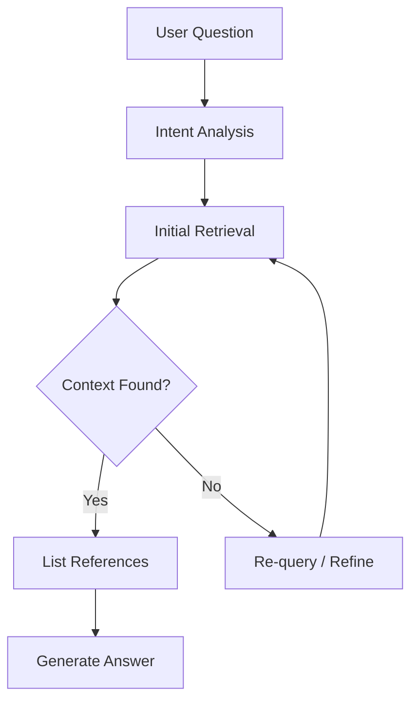

# Kore Knowledge Base Agent

The **Kore Knowledge Base Agent** is a powerful AI-driven component designed to ingest, understand, and retrieve knowledge from a multitude of structured and unstructured data sources. Its primary purpose is to enable intelligent, contextual responses to user queries using a sophisticated retrieval-augmented generation (RAG) pipeline.

## 🚀 What Is the Knowledge Base Agent?

The Kore Knowledge Base Agent is not just a search tool — it's a **cognitive agent** capable of dynamically sourcing, reasoning, and responding to questions by intelligently navigating through:

- Uploaded documents
- Organization-managed knowledge bases
- Live databases (via schema-aware queries)

It bridges the gap between data availability and actionable knowledge by applying a layered understanding and retrieval strategy.

## 🔍 Multi-Source Querying

When a user interacts with the agent, the following process unfolds:

1. **Input Analysis**: The agent interprets the question using a language model, identifying key terms and intent.
2. **Source Matching**: It queries multiple knowledge sources:
   - Semantic documents uploaded to Kore
   - Internal knowledge systems (wikis, manuals, repositories)
   - Connected relational databases (PostgreSQL, MySQL, etc.)
3. **Context Retrieval**: Uses vector similarity search, keyword ranking, and schema inference to retrieve relevant content.

## 🧠 The Kore RAG Module

At the heart of the agent lies the **Kore RAG (Retrieval-Augmented Generation) module**, which orchestrates the knowledge synthesis process.

### Key Technologies Used:

- **BM25**: A probabilistic information retrieval technique for keyword-based scoring.
- **Vector Search**: Embedding-based similarity search across documents.
- **NVIDIA Embeddings & Rerankers**: State-of-the-art transformer models fine-tuned for semantic understanding and reranking results with high precision.

### Semantic Classification

All uploaded documents go through semantic parsing and are indexed accordingly:

```plaintext
+------------------+----------------------------+
| Document Type    | Classification Strategy    |
+------------------+----------------------------+
| PDFs             | Vector embeddings + BM25   |
| Spreadsheets     | Table parsing + embeddings |
| Wikis / Markdown | Chunked + hierarchical RAG |
+------------------+----------------------------+
```

## 🔄 Query Lifecycle
Here's how the agent processes a question from start to finish:

User submits a question
1. Initial context search across:
2. Kore RAG-indexed documents
   - Live databases (with schema inference)
   - Internal repositories
3. Reference extraction: Lists supporting documents, tables, or database records.
4. Answer synthesis: The agent generates a response only if the retrieved context is sufficient.
5. Iterative search: If context is incomplete, the agent automatically re-queries or refines its strategy.



## 🔗 Database Intelligence
One standout feature of the agent is its ability to connect to databases and reason about them dynamically:
- Inspects schema on-the-fly
- Generates safe, optimized SQL queries
- Joins contextual data with document-based knowledge
- Supports federated querying across multiple sources

💡 This allows Kore to provide precise answers even when the knowledge resides in structured tabular formats.

## 📎 Reference-Aware Responses
The Knowledge Base Agent is designed to be transparent and traceable:
- All responses include a reference block.
- Users can review exact sources used to build the answer.
- Responses are auditable, supporting compliance and trust.

## 🔁 Adaptive Reasoning
The Kore agent does not stop at the first layer of information. It adapts its approach:
- If initial results are ambiguous or incomplete, it expands its query.
- Can switch strategies between keyword search and semantic reasoning.
- Designed to respond only when confident, reducing hallucinations.

## ✅ Summary
| Feature                    | Description                                       |
| -------------------------- | ------------------------------------------------- |
| Multi-source knowledge     | Documents, internal KBs, live databases           |
| Kore RAG pipeline          | Powered by BM25, vector search, NVIDIA embeddings |
| Dynamic DB querying        | Schema-aware, AI-generated SQL                    |
| Reference-based answers    | Includes citations and context                    |
| Iterative & adaptive logic | Re-queries when needed, ensuring accuracy         |

## 📌 Use Cases
- Internal Q&A assistants for enterprises
- Technical documentation bots
- Support automation for complex product suites
- Domain-specific compliance bots (e.g., pharma, legal, finance)