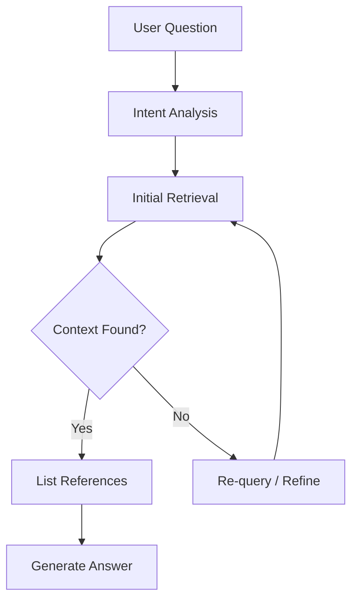
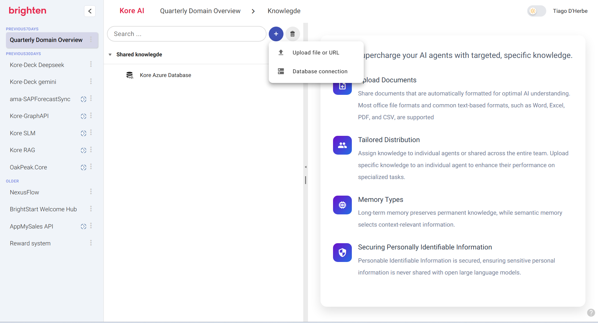
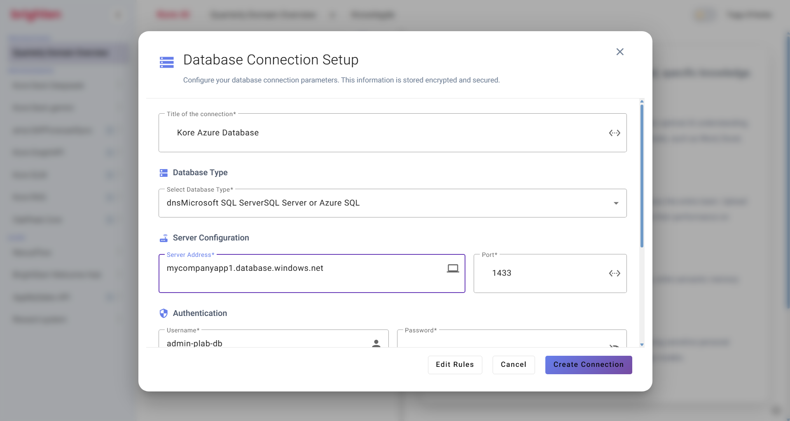
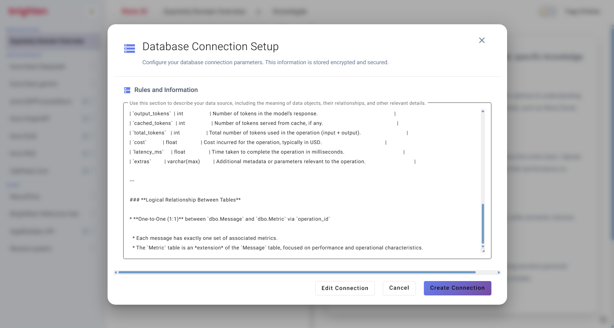
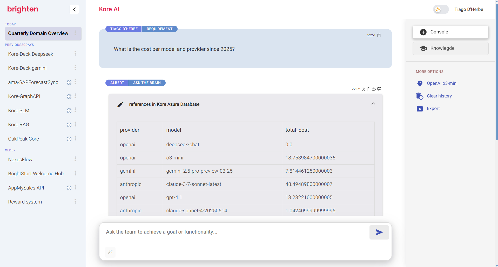

# Knowledge Base agent

The **Knowledge Base** agent is a cutting-edge AI agent engineered to transform how you access and utilize information. Imagine an intelligent assistant that can instantly find, understand, and synthesize knowledge from all your company's data, providing precise and contextual answers to your questions.

At its core, the agent is powered by a diverse set of connectors and a sophisticated <a target="_blank" href="/compass/ecosystem/compass_rag.html"><strong>Retrieval-Augmented Generation (RAG) pipeline</strong></a>, ensuring that every response is not only generated but also grounded in reliable, verifiable data.

## Introduction

The **Knowledge Base** agent acts as a **cognitive agent**, a truly intelligent entity capable of dynamically sourcing, reasoning over, and responding to your queries by intelligently navigating through:

  * **Uploaded documents:** From reports to manuals, simply upload your files, and the agent will make sense of them.
  * **Organization-managed knowledge bases:** Integrate with your existing wikis, internal repositories, and documentation systems.
  * **Live databases:** Get real-time, precise answers by connecting directly to your structured data.

It masterfully bridges the gap between raw data and actionable knowledge, applying a layered understanding and retrieval strategy to deliver unparalleled accuracy and relevance.

## Multi-Source Querying

When you interact with the agent, a seamless and intelligent process unfolds:

1.  **Input Analysis**: The agent first interprets your question using advanced language models, meticulously identifying key terms, intent, and any underlying nuances.
2.  **Source Matching**: It then intelligently queries multiple knowledge sources in parallel, ensuring comprehensive coverage:
      * **Semantic documents uploaded to Compass:** Leverages the rich understanding derived from uploaded files.
      * **Organisation knowledge:** Accesses your organization's curated information in buckets, wikis, manuals, and internal repositories.
      > 📚 View also: [Knowledge Management](/org/buckets.html)

      * **Connected relational databases:** Dynamically interacts with databases like PostgreSQL, MySQL, and others.
3.  **Context Retrieval**: To pinpoint the most relevant information, the AI agents employs a combination of advanced techniques: vector similarity search for conceptual matches, keyword ranking for precise term identification, and schema inference for understanding database structures.

### Semantic Classification

All semantic documents uploaded to Compass undergo a rigorous semantic parsing process and are intelligently indexed to optimize retrieval:

| Document Type              | Description                                       |
| -------------------------- | ------------------------------------------------- |
| Multi-source knowledge     | Classification Strategy                           |
| Office and PDFs            | Vector embeddings + BM25                          |
| Spreadsheets               | Table parsing + embeddings                        |
| Wikis / Markdown           | Chunked + hierarchical RAG                        |

This multi-faceted approach ensures that regardless of the document format, the agent can extract and leverage its content effectively.

## Query Lifecycle
Here's how the agents meticulously processes a question from your initial input to a comprehensive answer:

1.  **User submits a question:** Your journey begins with a natural language query.
2.  **Initial context search:** The agent immediately casts a wide net, searching across:
      * **Compass Agentic RAG-indexed documents:** Uploaded and semantically processed files.
      * **Live databases (with schema inference):** Real-time data from your connected databases.
      * **Internal repositories:** Your organization's structured and unstructured internal knowledge.
3.  **Reference extraction:** If relevant context is found, the agent meticulously identifies and lists the supporting documents, tables, or specific database records that contribute to the answer.
4.  **Answer synthesis:** The agent generates a clear, concise, and accurate response *only if* the retrieved context is sufficient and unambiguous. This prevents speculative or "hallucinated" answers.
5.  **Iterative search:** If the initial context is incomplete or ambiguous, the agent doesn't give up. It automatically re-queries its sources or refines its search strategy, diving deeper to find the information needed for a confident response.

## Database Intelligence

One of the most remarkable features of the Knowledge Base agent is its innate ability to connect to and **dynamically reason** about your databases. This allows Compass to provide real-time, precise answers, even when the knowledge resides in highly structured tabular formats.

Here's a detailed breakdown of how it achieves this:

  * **Inspects schema on-the-fly:** Based on your natural language query and the intended report or information need, Compass intelligently analyzes the database schema. This includes understanding table names, column types, relationships between tables, and even indexed columns. It dynamically identifies the most relevant tables and relationships that best fit the report intent extrapolated from your prompt, ensuring efficient and accurate data retrieval.

  * **Generates safe, optimized SQL queries:** Compass is designed for broad compatibility with most major database engines, including MSSQL Server, PostgreSQL, MySQL, and Oracle. When generating SQL queries, the agent prioritizes:

      * **Safety:** Queries are carefully constructed to prevent SQL injection vulnerabilities and adhere to best practices for secure database interaction.
      * **Optimization:** Compass considers factors like table indexes, data volume, and the specific characteristics of the target database engine to generate highly performant SQL queries. This ensures that even complex queries execute quickly, minimizing latency.
      * **Readability:** While optimized for performance, the generated SQL is also structured to be clear and understandable.

  * **Joins contextual data with document-based knowledge:** The agent doesn't just pull data from databases in isolation. After dynamically building and executing the multiple SQL queries identified to satisfy your request, Compass intelligently processes the results. It then seamlessly integrates this structured database output with other relevant document-based knowledge available within its knowledge base. This cross-referencing allows for a richer, more comprehensive, and contextually aware answer that spans both structured and unstructured data sources.

  * **Supports federated querying across multiple sources:** The Knowledge Base agent excels at handling requests that require information from diverse locations. It can simultaneously query multiple databases, different document repositories, and the **organisation** knowledge systems. This "federated querying" capability allows it to piece together a complete answer from fragmented information sources, providing a unified view of your organizational knowledge.

>💡 This allows Compass to provide real-time precise answers even when the knowledge resides in structured tabular formats such as databases.
> Step by step instructions:

<table>
<tbody>
  <tr>
   <td>
       
      <b>Step 1: Connect your Database.</b> Begin by adding a new database connector within the Knowledge Base agent interface.
   </td>
   <td>
       
      <b>Step 2: Enter Connection Details.</b> Provide the connection string for the database you wish the agent to query. This allows Compass to establish a secure link.
   </td>
  </tr>
  <tr>
   <td>
       
      <b>Step 3: Optimize with Instructions (Optional).</b> You can optionally add specific instructions to guide the agent, helping it navigate your database schema more efficiently and quickly respond to complex queries.
   </td>
   <td>
       
      <b>Step 4: Query and Get Answers. Simply type your question.</b> The Knowledge Base agent will dynamically build and execute the appropriate SQL query, providing you with real-time answers directly from your database.
   </td>
  </tr>
</tbody>
</table>

Connecting Compass to your databases requires careful consideration of network accessibility.

  * **On-Premise Deployments:** If you are running Compass on-premise, please ensure robust network connectivity between your Compass server and your database server(s). This typically involves configuring firewall rules to allow traffic on the necessary database ports and ensuring proper routing.
  * **Cloud Deployments:** If your Compass instance is running on the Cloud and your database is also cloud-hosted, you might need to add Compass server IP addresses or network ranges to your database's firewall and security group rules. This ensures that Compass has authorized access to your database instances.

For detailed guidance on network configuration and security best practices, please contact Compass support. They can provide specific IP ranges or recommend secure connectivity patterns tailored to your deployment environment.

> 📚 View also: [Enterprise Knowledge](/org/buckets.html)

## Adaptive Reasoning
The Compass agent does not stop at the first layer of information. It adapts its approach:
- If initial results are ambiguous or incomplete, it expands its query.
- Can switch strategies between keyword search and semantic reasoning.
- Designed to respond only when confident, reducing hallucinations.

## Use Cases
- Internal Q&A assistants for enterprises
- Technical documentation chatbots
- Support automation for complex product suites
- Domain-specific compliance chatbots (e.g., pharma, legal, finance)

> 📚 View also: [Enterprise Chatbots](/org/chatbots.html)
