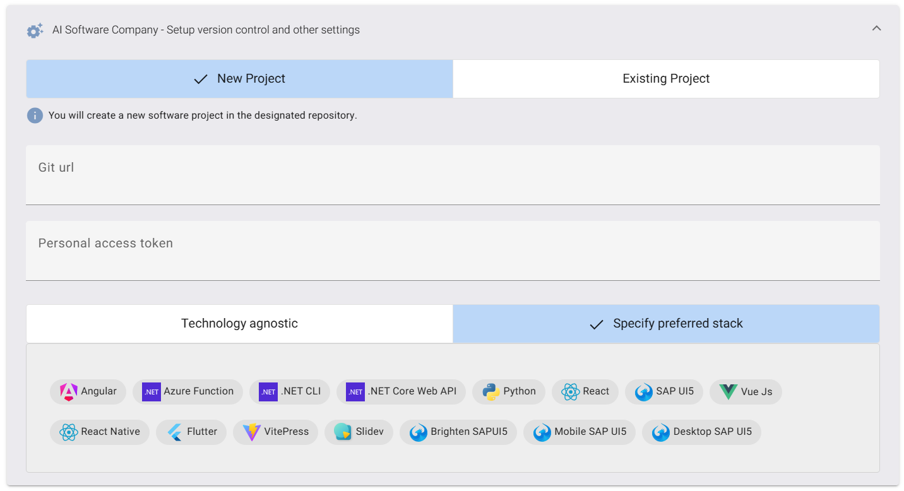

# AI Software Team

Transform your ideas into reality faster and with unparalleled precision with The Kore AI Software Team. This advanced collective is your intelligent software development companion, seamlessly integrating into your workflow to help you build, modify, and gain deep insights into your codebase. This specialized team of AI agents works in unison, leveraging collective intelligence to streamline the entire development process, turning your vision into tangible, high-quality software.

## Introduction

Imagine having a dedicated, expert software team at your fingertips, capable of understanding your needs, designing robust solutions, and meticulously implementing code. That's the power of the Kore AI Software Team – designed to accelerate your development cycles, enhance code quality, and provide continuous architectural and product insights.

**Meet Your Expert AI Development Team:**

The Kore AI Software Team is comprised of specialized agents, each embodying a critical role within the software development lifecycle. They collaborate to ensure comprehensive understanding, meticulous planning, and precise execution of your requests.

| Agent     | Role                  | Core Function |
|-----------|-----------------------|---------------|
| Martha    | 📋 **Product Manager**   | The visionary of the team, focused on meticulous requirements analysis and guiding the product direction. Martha ensures the technical implementation aligns perfectly with your business goals and user needs. |
| Bruce     | 📐 **Architect**         | The master builder, meticulously designing the system structure and technical planning to ensure robust, scalable, and maintainable solutions. Bruce provides the foundational technical blueprint for your project. |
| Tilda     | 💻 **Software Engineer** | The hands-on implementer, responsible for bringing designs to life through precise coding, efficient implementation, and adherence to best practices. Tilda ensures your vision translates into high-quality, functional code. |

## Orchestrated AI Development
**The Collaborative Intelligence of the AI Software Team**:
Each agent within the Kore AI Software Team plays a distinct yet interconnected role in responding to your development requests:

- **Martha, the Product Manager**:
  - **Detailed PRD Compilation**: Martha synthesizes your input and the project's context to compile a comprehensive Product Requirements Document (PRD). This includes:
    - **Programming Language**: Identifying and confirming the core programming languages.
    - **Product Goals**: Clearly articulating the overarching objectives of the feature or project.
    - **User Stories**: Crafting granular user stories to capture specific functionalities from a user's perspective.
    - **Requirement Analysis**: Deconstructing complex requests into manageable and actionable requirements.
    - **Requirement Pool**: Maintaining a consolidated list of all identified requirements.
    - **Product UI/UX Design**: Providing high-level conceptual guidance on the user experience and interface considerations.
  - **Bruce, the Architect**:
    - **Technical Blueprinting**: Bruce translates the product requirements into a robust technical design, addressing potential challenges and ensuring scalability and maintainability. His output includes:
    - **Repository Analysis**: Deeply understanding the existing codebase structure and dependencies.
    - **Architecture Diagram**: Visualizing the system components, data flows, and interactions.
    - **File List**: Identifying relevant files for modification and proposing new file structures.
    - **Data Structures and Interfaces**: Defining the optimal data models and API contracts.
    - **Program Call Flow**: Illustrating the sequence of operations and function calls.
- **Tilda, the Software Engineer**:
  - **Precision Implementation**: Tilda seamlessly executes the architectural designs and product requirements by generating high-quality code. Her focus areas include:
  - **Required Other Language Packages**: Identifying and integrating necessary external libraries or packages.
  - **Logic Analysis**: Breaking down complex business logic into manageable code units.
  - **API Specification** (if applicable): Documenting any new or modified API endpoints.
  - **Shared Knowledge** (Code Patterns): Applying established best practices and design patterns.
  - **Write Code**: Generating the actual code, adhering to the specified programming language, style, and project conventions.

## Starting a new project

Embark on new development ventures with a significant head start. The Kore AI Software Team enables you to quickly establish robust, standardized projects from a curated collection of tech stack templates.

- **Choose from Our Growing Collection of Tech Stacks**: Select the ideal foundational technologies for your project from Kore's pre-configured and optimized templates. These templates represent battle-tested environments designed for efficiency and scalability.
- **Get a Standardized Project Structure**: Instantly generate a clean, well-organized project directory with all necessary configurations, dependency management, and build scripts in place. This eliminates tedious manual setup and ensures consistency across your projects.
- **Begin Development with Best Practices Already Implemented**: Our templates are not just empty shells; they are pre-populated with foundational elements that adhere to modern coding standards, architectural patterns, and security considerations, guiding your development team from day one.
- **Each Stack Comprises a Set of KoreRules Specifically Designed to Guide LLMs**: Crucially, each tech stack template includes pre-defined KoreRules. These intelligent guidelines are tailored to the specific nuances of the chosen technology stack, providing the underlying Large Language Models (LLMs) with precise instructions to generate contextually accurate and high-quality code, ensuring compatibility and optimal performance.

## Implement a new feature

Adding features to your existing codebase is where Kore truly shines, demonstrating the collaborative power of the AI Software Team to seamlessly integrate new functionalities.

1. **Connect Your Repository**: Utilize Kore's robust Git integration to securely link your existing codebase. This provides the AI Software Team with real-time access to your project's history, current state, and structure.
2. **Let Agents Analyze**: Upon connection, the entire AI Software Team springs into action. They automatically perform a deep, contextual analysis of your codebase, understanding its architecture, dependencies, coding patterns, and existing logic. This foundational analysis ensures that any new feature implementation is perfectly integrated.
3. **Request Your Feature**: Clearly articulate the feature you wish to implement. Be specific about the desired functionality, user interaction, and any expected outputs. The AI Software Team will then process this request, leveraging their collective intelligence to plan and execute the implementation.
4. **Review Implementation**: Once the agents have generated the proposed code changes, Kore presents them for your review. This allows you to inspect the generated code, evaluate its correctness, and ensure it meets your expectations.
Merge When Ready: When you are completely satisfied with the generated code and have validated its functionality, you can seamlessly merge the changes into your main branch, accelerating your delivery pipeline.

**For Best Results When Requesting Features**:
To maximize the efficiency and accuracy of the AI Software Team, consider these best practices:

- **Be Specific About File Locations and Components that Need Modification**: Guide the agents by pointing them to relevant files, modules, or components that should be involved in the change. This precision helps them focus their efforts and reduces ambiguity.
- **Provide Context About Your Project's Architecture and Dependencies**: While the agents analyze your code, providing a high-level overview of complex architectural patterns, external integrations, or unusual dependencies can significantly enhance their understanding and the quality of their output.
- **Break Complex Features into Smaller, Manageable Requests**: For very large or intricate features, consider breaking them down into a series of smaller, sequential requests. This allows the AI Software Team to address each part systematically, ensuring higher accuracy and easier review cycles.

## Fine-Grained Control
### Directing Individual Agents
While sending a change request will engage the entire AI Software Team to collaboratively solve your request, Kore also provides the flexibility for more targeted interventions.

- **Targeted Requests**: Alternatively, you may directly send a request to just one specific agent by using @<agent_name>. For instance, you could @Martha to refine a PRD detail, @Bruce to explore an architectural alternative, or @Tilda to implement a minor code change.
- **Improved Experience with Context**: This direct targeting can significantly improve the experience for specific tasks because, for a given request, the agents already have their context in place from prior interactions or analysis, allowing them to execute tasks with even greater precision and efficiency.

## Iterative Development
### Iterative Development & Continuous Insight
The Kore AI Software Team fosters an iterative development cycle, providing you with continuous insights and control over the process.

- **Agent-Driven Questions for Deeper Understanding**: At each cycle of their operation (e.g., after analysis, planning, or initial implementation), the agents will produce intelligent questions based on their findings. Kore allows you to answer these questions directly, gaining deeper insight over your codebase and ensuring the agents have all the necessary information to proceed accurately. This interactive feedback loop guarantees alignment and prevents misinterpretations.
- **Next Steps and Recommendations for Guided Evolution**: By the end of each cycle, the agents also identify "Next Steps" and "Recommendations." They pinpoint, often by file, the exact suggested changes, potential improvements, or areas requiring further attention. This proactive guidance helps you optimize your development roadmap and maintain a healthy, evolving codebase.