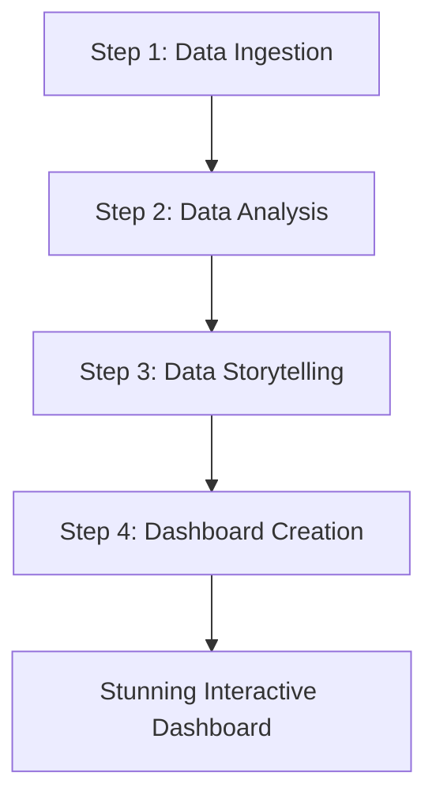

# Business BI Team

### Your Intelligent Data Storytellers

Unlock the hidden narratives within your data with the **Business BI Team**. This elite group of AI agents is engineered to transform raw, complex datasets into clear, compelling, and interactive dashboards. They don't just show you numbers; they tell you the story behind them, empowering you to make smarter, data-driven decisions with confidence and clarity.

## Introduction

Imagine a dedicated team of data scientists, analysts, and designers working in perfect harmony to handle your entire business intelligence pipeline. That is the essence of the Compass Business BI Team. From initial data ingestion to the final, polished dashboard, these agents collaborate to reveal deep insights, visualize complex relationships, and present information in a way that feels like a breeze—elegant, intuitive, and impactful.

**Meet Your Expert AI Business Intelligence Team:**

The Compass Business BI Team is a synergistic collective of specialized agents, each mastering a critical phase of the data analysis and visualization lifecycle.

| Agent   | Role                     | Core Function                                                                                                                                                           |
|---------|--------------------------|-------------------------------------------------------------------------------------------------------------------------------------------------------------------------|
| DashDan  | 📊 **Lead BI Strategist**  | The visionary of the team, Aurora masterfully interprets your goals, orchestrates the data narrative, and conceptualizes the most effective way to visualize your story. |
| Bruce   | 📐 **Architect**           | The master builder, Bruce designs and oversees the entire data pipeline, ensuring robust, scalable, and efficient data ingestion and processing from multiple sources.      |
| Nova    | 💻 **Engineer**   | The hands-on implementer, Nova brings the final dashboard to life, crafting a stunning, feature-rich, and animated user experience with slick, responsive effects.        |

## The BI Pipeline
### From Raw Data to Insight

The team operates in a seamless, four-stage process, ensuring a meticulous and intelligent transformation of your data.

### Step 1: Unified Data Ingestion

The journey begins with gathering all relevant information. Bruce, the Architect, takes the lead here, establishing a robust pipeline to unify your data from a multitude of sources. This isn't just about moving data; it's about creating a holistic and comprehensive dataset ready for analysis.

*   **Knowledge Connectors:** Seamlessly pulls data from files uploaded to your organization's knowledge base, including formats like CSV, Excel, and Parquet.
*   **Model Context Protocol (MCP):** Integrates pre-configured data streams and contextual information from other enterprise systems.
*   **Live API Connections:** Connects directly to external and internal APIs, ensuring your analysis is powered by real-time data.
*   **Database Integration:** Queries and fetches data from connected relational and non-relational databases.

### Step 2: Deep Data Analysis & Correlation

Once the data is ingested, Aurora, the Lead BI Strategist, begins the process of deep analysis. This is where raw numbers start to become meaningful insights. Using a sophisticated array of techniques, she uncovers the hidden patterns and relationships within your data.

*   **Information Correlation:** Intelligently identifies and maps relationships between disparate datasets.
*   **Advanced Grouping & Subtotalling:** Automatically aggregates and segments data to highlight key trends and summaries.
*   **Data Science Techniques:** Applies a range of data science methodologies, from statistical analysis to machine learning models, to forecast trends, identify anomalies, and reveal deeper correlations.

### Step 3: The Art of Data Storytelling

With a deep understanding of the data, Aurora's primary focus shifts to crafting a compelling narrative. An effective dashboard is not just a collection of charts; it's a story that guides the user to a conclusion.

*   **Intelligent Narrative Drafting:** Aurora drafts a comprehensive story that explains the data's meaning, highlighting the most critical insights, trends, and outliers.
*   **Presentation Structure:** She then outlines a logical presentation structure for this story, deciding the flow of information and the key points to be presented in each section.
*   **Visualization Sketching:** For each part of the story, Aurora intelligently selects and sketches the ideal visualization type that best represents that particular set of data, ensuring the medium perfectly fits the message.

### Step 4: Crafting the Interactive Dashboard

With the blueprint and narrative in hand, Nova, the Engineer, takes center stage to build the final product. She transforms the concepts into a stunning and highly interactive dashboard that feels effortless and elegant.

*   **Feature-Rich Interface:** The dashboard is packed with powerful features, including intuitive **filtering**, dynamic **ordering**, and one-click **export** options for sharing your insights.
*   **Animated & Slick Effects:** Data presentation is enhanced with subtle animations and slick transition effects, making the experience of exploring data feel like a breeze.
*   **Responsive Design:** The dashboard is beautifully crafted to be fully responsive, providing a seamless experience on any device.

## Visualization Mastery

The Business BI Team is capable of producing a wide array of visualization modes, ensuring that every piece of data is displayed in the most effective and intuitive way possible.

*   **Pie & Donut Charts:** For clear proportional breakdowns.
*   **Bar & Column Charts:** For comparing values across categories.
*   **Line & Area Charts:** For tracking trends over time.
*   **Heatmaps:** For visualizing density and distribution.
*   **Scatter Plots:** For identifying correlations between variables.
*   **Geospatial Maps:** For plotting data on geographical maps.
*   **Tables & Pivot Tables:** For detailed, granular data exploration.

The Business BI Team redefines what's possible with your data, turning complex analysis into an elegant, insightful, and empowering experience.
