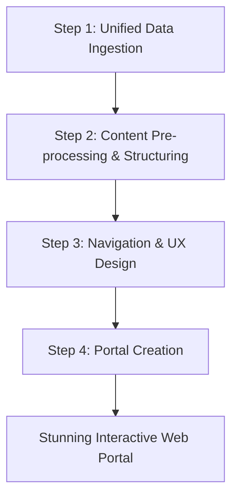

# WebCollective Team

### Your Master Builders for Stunning Web Portals

Supercharge your digital presence with the **WebCollective Team**, a specialized group of AI agents dedicated to building exceptional company and business web portals. This team transforms your scattered information into modern, professional websites that are not only visually stunning but also intuitively structured. Whether you need a project showcase, a team hub, or a departmental portal, the WebCollective team is your expert partner in crafting a compelling online experience.

## Introduction

Imagine having a team of web strategists, information architects, and expert developers at your disposal, ready to turn your vision into a high-impact web portal. The WebCollective Team is more than just a website generator; it's a sophisticated system for content analysis, user experience design, and modern web development. By ingesting and understanding your data, the team builds a cohesive navigation and a rich user experience that highlights your content, all while adhering to the highest standards of modern web design.

**Meet Your AI Web Development Experts:**

The WebCollective Team is a synergistic collective of specialized agents, each mastering a critical phase of the web development lifecycle.

| Agent   | Role                     | Core Function                                                                                                                                                           |
|---------|--------------------------|-------------------------------------------------------------------------------------------------------------------------------------------------------------------------|
| Bob  | 🕸️ **Lead Web Strategist** | The visionary of the team, Bob interprets your goals, orchestrates the content narrative, and conceptualizes the most effective way to structure and present your information. |
| Bruce  | 🏛️ **Information Architect** | The master planner, Bruce designs the portal's structure, ensuring a logical and intuitive navigation system that makes information easy to find and understand.      |
| Nova   | 🎨 **Web Developer & Designer** | The hands-on creator, Nova brings the final portal to life, crafting a stunning, feature-rich, and animated user experience with slick, responsive effects.        |

## The Web Creation Pipeline
### From Raw Information to Interactive Portal

The team operates in a seamless, four-stage process, ensuring a meticulous and intelligent transformation of your content into a polished web portal.

### Step 1: Unified Data Ingestion

The journey begins with gathering all relevant information. Bruce, the Information Architect, takes the lead here, establishing a robust pipeline to unify your content from a multitude of sources. This creates a holistic and comprehensive foundation for your web portal.

*   **Knowledge Connectors:** Seamlessly pulls content from files uploaded to your organization's knowledge base, including documents, presentations, and spreadsheets.
*   **Model Context Protocol (MCP):** Integrates pre-configured data streams and contextual information from other enterprise systems.
*   **Live API Connections:** Connects directly to external and internal APIs, ensuring your portal is powered by real-time data.
*   **Database Integration:** Queries and fetches data from connected relational and non-relational databases.
*   **Git Repositories:** Analyzes codebases and documentation from Git repositories to create technical or project-based portals.

### Step 2: Content Pre-processing & Structuring

Once the content is ingested, Bob, the Lead Web Strategist, begins the process of deep analysis and structuring. This is where raw information starts to take shape as a cohesive body of content.

*   **Content Analysis:** Bob intelligently analyzes the ingested content, identifying key themes, topics, and entities.
*   **Relationship Mapping:** The agent maps relationships between different pieces of content, understanding how they connect and relate to one another.
*   **Categorization and Tagging:** Content is automatically categorized and tagged, creating a structured taxonomy that will drive the portal's navigation and search capabilities.
*   **Summarization and Extraction:** Key information is summarized, and important details are extracted to be highlighted on the portal.

### Step 3: Navigation & UX Design

With a deep understanding of the content, Bruce designs the user experience and navigation. The goal is to create an intuitive and engaging journey for the user.

*   **Information Architecture:** Bruce designs a logical and hierarchical structure for the content, ensuring that users can easily find what they are looking for.
*   **Navigation Systems:** The agent designs the primary navigation menus, as well as secondary navigation elements like breadcrumbs and related links.
*   **User Flow Mapping:** Bruce maps out the user's journey through the portal, optimizing the flow for clarity and ease of use.
*   **Wireframing:** The agent creates wireframes for key pages, outlining the layout and placement of content and interactive elements.

### Step 4: Crafting the Interactive Portal

With the blueprint and structure in hand, Nova, the Web Developer & Designer, takes center stage to build the final product. She transforms the concepts into a stunning and highly interactive web portal.

*   **Modern Web Standards:** The portal is built using the latest web standards, including HTML5, CSS3, and modern JavaScript frameworks, ensuring compatibility and performance.
*   **Responsive Design:** The portal is beautifully crafted to be fully responsive, providing a seamless experience on any device, from desktops to mobile phones.
*   **Animations and Effects:** The user experience is enhanced with subtle animations, transitions, and micro-interactions that make the portal feel alive and engaging.
*   **Interactive Elements:** The portal includes interactive elements like dynamic filtering, real-time search, and interactive charts and graphs to engage the user and make the content more explorable.

## Built-in Tools

To further enhance the creation process, the WebCollective team comes with powerful built-in MCP servers:

*   **Deep Search:** This tool allows the agents to conduct deep and thorough research within the provided knowledge sources, ensuring that every detail is captured and included in the portal.
*   **Compass AI Note Taking:** This server includes tools that allow you to seamlessly interact with your personal notes while guiding the creation of the portal, ensuring that no idea is lost.

The WebCollective Team redefines what's possible with your content, turning scattered information into an elegant, insightful, and empowering web experience.
