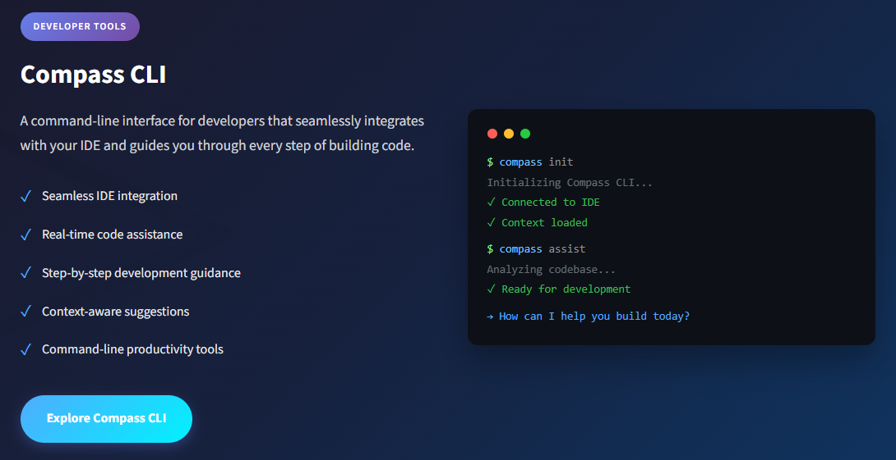

# Compass CLI

A powerful command-line interface that seamlessly integrates with your IDE and guides you through every step of building code. Get real-time assistance, context-aware suggestions, and productivity tools right where you work.

::: info Learn More
Visit the [Compass CLI home page](https://www.compassap.ai/portfolio/command-line-interface.html) for more information and interactive demos.
:::



## Key Features

### Seamless IDE Integration
Works seamlessly with VS Code, JetBrains IDEs, Vim, Neovim, and more. Your CLI assistant stays in sync with your editor context automatically.

### Real-time Assistance
Get instant code suggestions, error explanations, and optimization recommendations as you type. No waiting, no context switching.

### Step-by-Step Guidance
Break down complex tasks into manageable steps. Compass CLI guides you through implementation with clear, actionable instructions.

### Context-Aware
Understands your project structure, dependencies, and coding patterns. Suggestions are tailored to your specific codebase and tech stack.

### Productivity Tools
Generate boilerplate, refactor code, create tests, and manage dependencies. Common tasks are just a command away.

### Enterprise Security
Your code stays private. Local processing options, SOC 2 compliance, and enterprise-grade security for sensitive projects.

## Installation

Install Compass CLI with your preferred package manager:

### npm

```bash
npm install -g @compass-ai/cli
```

### Windows

```bash
winget install CompassAI.CLI
```

## Getting Started

After installation, initialize Compass CLI in your project:

```bash
compass init
```

This will:
- Connect to your IDE
- Analyze your project structure
- Load context from your codebase
- Prepare the environment for development assistance

## Workflow

### 1. Initialize Your Project

Run `compass init` to connect to your IDE and analyze your project structure. Compass learns your codebase instantly.

```bash
$ compass init
✓ Project analyzed
✓ IDE connected
```

### 2. Describe Your Task

Tell Compass what you want to build in plain English. It understands complex requirements and breaks them down.

```bash
$ compass "add user auth"
Planning implementation...
→ 5 steps identified
```

### 3. Follow Guided Steps

Compass breaks down the task and guides you through each step, generating code and explaining decisions.

```bash
Step 1/5: Create auth module
✓ Generated: auth.ts
→ Continue? (y/n)
```

### 4. Ship with Confidence

Review the changes, run tests, and deploy. Compass helps ensure code quality at every step.

```bash
$ compass review
✓ All tests passing
✓ No security issues
✓ Ready to ship!
```

## Usage Examples

### Code Assistance

Get help while coding:

```bash
compass assist
```

This analyzes your codebase and provides context-aware assistance based on your current file and project structure.

### Generate Code

Create boilerplate and common patterns:

```bash
compass generate component MyComponent
```

### Run Quality Checks

Review your code before committing:

```bash
compass review
```

## Features in Detail

### IDE Integration

Compass CLI works with popular IDEs and editors:
- Visual Studio Code
- JetBrains IDEs (WebStorm, IntelliJ IDEA, PyCharm, etc.)
- Vim/Neovim
- Sublime Text
- And more

The CLI maintains awareness of your current file, cursor position, and project context to provide relevant assistance.

### Context-Aware Suggestions

Compass CLI analyzes:
- Project structure and dependencies
- Coding patterns and conventions
- Framework and library usage
- Current file context
- Git history and changes

This enables it to provide suggestions that fit naturally into your existing codebase.

### Security and Privacy

- **Local Processing**: Option to process sensitive code locally
- **SOC 2 Compliance**: Enterprise-grade security standards
- **Private Code**: Your code stays private and secure
- **No Data Retention**: Optional modes with zero data retention

## Support

For issues, questions, or feature requests, please visit our [support portal](https://compass.ai/support) or contact our team.
