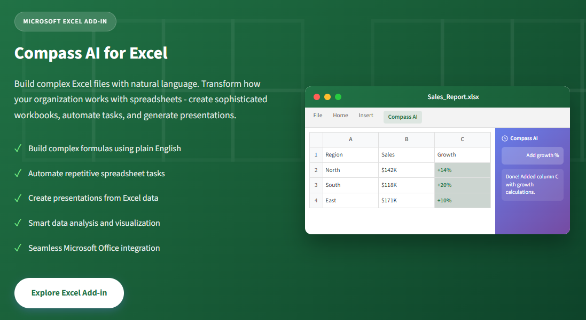

# Compass AI Excel Add-in

Transform how your organization works with spreadsheets. Compass AI Excel Add-in lets anyone create sophisticated workbooks, automate repetitive tasks, and generate presentations - all by simply describing what you need.

::: info Learn More
Visit the [Excel Add-in home page](https://www.compassap.ai/portfolio/excel-addin.html) for more information and to download the add-in.
:::

## Key Features

- **Build complex formulas using plain English** - Stop memorizing syntax
- **Automate repetitive spreadsheet tasks instantly** - Save hours every week
- **Create presentations directly from Excel data** - Seamless integration
- **Integrate with other Compass AI agents** - Multi-agent ecosystem
- **Smart data analysis and visualization** - AI-powered insights

## Performance Metrics

Organizations using Compass AI Excel Add-in see dramatic improvements:

- **75%** Reduction in Spreadsheet Creation Time
- **90%** Fewer Formula Errors
- **5x** Faster Report Generation
- **100%** Natural Language Interface

## Why Choose Compass AI Excel Add-in

### Natural Language Spreadsheet Building

Stop memorizing complex formulas and syntax. Simply describe what you want in plain English, and Compass AI builds it for you - from simple calculations to multi-sheet data models.

**Capabilities:**
- Create VLOOKUP, INDEX/MATCH, and array formulas by description
- Build pivot tables and charts with a simple request
- Generate complex conditional formatting rules instantly
- Transform messy data into structured tables automatically

### Intelligent Automation at Scale

Eliminate hours of repetitive work. Compass AI learns your patterns and automates the tedious tasks that drain your team's productivity every day.

**Capabilities:**
- Automate data cleaning and standardization
- Generate recurring reports with one command
- Batch process multiple workbooks simultaneously
- Create reusable templates from existing spreadsheets

### From Data to Presentation in Seconds

Leverage Compass AI's multi-agent ecosystem. Transform your Excel data directly into polished PowerPoint presentations, complete with visualizations and insights.

**Capabilities:**
- Generate executive presentations from spreadsheet data
- Create charts and graphs optimized for presentations
- Extract key insights and talking points automatically
- Maintain consistent branding across all outputs

## Use Cases

### Finance
**Automated Financial Modeling**

"Create a 3-year forecast model based on this historical data with 10% annual growth assumption" - Build complex financial models in minutes, not days.

### Sales
**Pipeline Analysis & Reporting**

"Analyze this sales data, identify top performers, and create a presentation for the quarterly review" - Turn CRM exports into actionable insights instantly.

### Operations
**Inventory & Supply Chain**

"Flag all items below reorder point and calculate optimal order quantities based on lead times" - Automate inventory management calculations.

### HR
**Workforce Analytics**

"Analyze headcount trends by department, calculate turnover rates, and visualize hiring patterns" - Transform HR data into strategic insights.

### Marketing
**Campaign Performance**

"Compare ROI across all marketing channels, highlight top performers, and create an executive summary" - Data-driven marketing decisions made easy.

### Project Management
**Resource Planning**

"Create a Gantt chart from this task list, identify resource conflicts, and suggest reallocation" - Visual project planning without the complexity.

### Data Analytics
**Data Transformation**

"Clean this dataset, split names into columns, standardize dates, and remove duplicates" - Data wrangling that used to take hours, done in seconds.

### Executive
**Board Reporting**

"Generate a board-ready presentation from these KPI sheets with trend analysis and key highlights" - Executive communications made effortless.

## Value for Everyone in the Organization

### For Individual Users
*Analysts, Accountants, Coordinators*

- Eliminate formula frustration - describe what you need
- Automate repetitive weekly/monthly tasks
- Learn Excel faster with AI-guided explanations
- Produce professional outputs without advanced skills
- Focus on analysis, not data manipulation

### For Team Leaders & Managers
*Team Leads, Department Heads*

- Standardize reporting across your team
- Reduce time spent on spreadsheet support requests
- Enable less technical team members to self-serve
- Accelerate project timelines with faster deliverables
- Improve data quality and consistency

### For Executives & Leadership
*Directors, VPs, C-Suite*

- Get board-ready presentations in minutes
- Reduce operational costs through automation
- Accelerate decision-making with faster insights
- Improve workforce productivity organization-wide
- Enterprise security that meets compliance requirements

## Key Features in Detail

### Natural Language Formula Building

Stop Googling Excel formulas. Simply describe what calculation you need, and Compass AI writes the formula for you - with explanations so you can learn and adapt.

**Example workflow:**
1. User: "Calculate the running total of column B"
2. Compass AI: Formula created: `=SUM($B$2:B2)`
3. Applied to cells C2:C100 with auto-fill

**Features:**
- Complex nested formulas generated from simple descriptions
- Automatic error checking and optimization suggestions
- Step-by-step explanations for learning

### Multi-Agent Ecosystem Integration

Compass AI Excel Add-in doesn't work in isolation. Connect with other Compass AI agents to transform your Excel data into presentations, reports, and more - all from within Excel.

**Example workflow:**
1. User: "Create a presentation from this sales data"
2. Connecting to Presentation Agent...
3. 12-slide presentation generated
4. Charts, insights, and speaker notes included

**Capabilities:**
- Generate PowerPoint presentations from Excel data
- Create Word documents and reports automatically
- Connect to business intelligence dashboards

## Microsoft Ecosystem Integration

Compass AI Excel Add-in seamlessly integrates with your Microsoft environment:

- **Microsoft Excel** - Native add-in integration
- **Microsoft 365** - Full cloud compatibility
- **SharePoint** - Shared workbook support
- **OneDrive** - Cloud storage integration

## Getting Started

Ready to transform your Excel experience? Get started with Compass AI Excel Add-in today.

Visit our [installation portal](https://excel-addin.compassap.ai/) for the manifest file and step-by-step setup instructions.

## Installation

1. Visit [https://excel-addin.compassap.ai/](https://excel-addin.compassap.ai/)
2. Download the manifest file
3. Follow the step-by-step installation instructions
4. Start using natural language to build spreadsheets

## Support

For issues, questions, or feature requests, please visit our [support portal](https://compass.ai/support) or contact our team.
