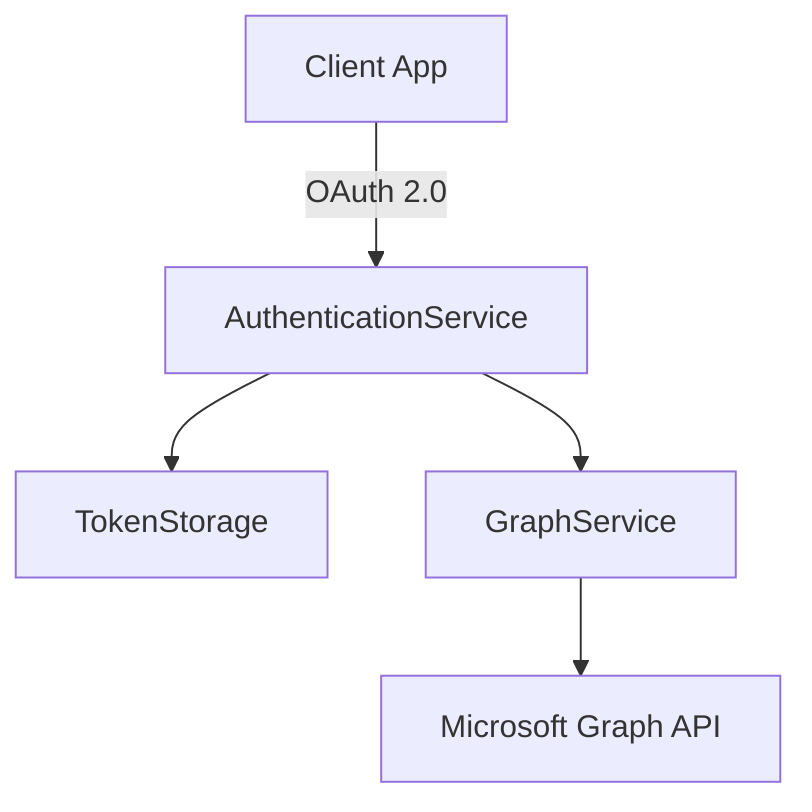

# Kore M365

Kore M365 is a powerful, .NET-based middleware component of the Kore ecosystem, purpose-built to seamlessly integrate with the Microsoft Graph API. It enables enterprises to manage identity, communication, storage, and collaboration workflows via unified, secure, and scalable APIs.

## 🔍 Overview

Kore M365 abstracts the complexity of Microsoft Graph and presents a robust API layer that simplifies integration with:

- Azure Active Directory (AAD)
- Microsoft Teams
- SharePoint
- OneDrive
- Outlook Mail and Calendar

It is engineered with security, scalability, and observability at its core, making it a perfect fit for modern cloud-native deployments.

---

## 🚀 Key Capabilities

### ✅ Unified Microsoft Graph Access
Interact with multiple Microsoft 365 services via a single, unified, and streamlined API gateway built on top of the official Microsoft Graph SDK.

### 🔐 Secure Authentication & Token Lifecycle
- Supports OAuth 2.0 (Client Credentials, Delegated)
- MSAL (Microsoft Authentication Library) integration
- Encrypted, database-backed token storage
- Automatic refresh and revocation of tokens
- Secure token management via Azure Key Vault

### ⚙️ Enterprise-Grade API Services
- **Users**: Directory access, profile sync, group resolution
- **Teams**: Creation, channel management, and messaging
- **SharePoint**: Site and document libraries access
- **OneDrive**: File/folder upload, download, and metadata handling
- **Email**: Send, receive, and filter messages
- **Calendar**: Schedule, read, and update events

### 🧠 Smart Caching Strategy
- In-memory + Redis caching
- Fine-grained expiration policies
- Intelligent key patterns (e.g., `teams:{id}`)

### 📊 Observability and Metrics
- Integration with Application Insights
- Custom counters for success/failure
- Operation timing and latency metrics
- Health check endpoints

---

## 🧱 Architecture Highlights

### 🧩 Modular Application Layer
- `AuthenticationService`: Manages OAuth flows
- `GraphService`: Core Microsoft Graph operations
- `GraphTokenService`: Refresh logic and token exchange
- `OneDriveService`: OneDrive-specific file operations
- `FederatedTokenService`: Secure token encryption and retrieval

### 🛠 Controllers (REST API Layer)
- `/auth`: Authenticate and refresh tokens
- `/users`: User management endpoints
- `/teams`: Teams and channel operations
- `/sharepoint`: Site and document libraries
- `/onedrive`: OneDrive file access
- `/emails`: Email sending and querying
- `/events`: Calendar operations

### 📄 Domain Models
Includes detailed object representations for:
- `GraphUser`
- `EmailMessage`
- `CalendarEvent`
- `DriveItemDto`
- `SharePointDocument`
- `TeamsChannel`
- `TokenData`
- `TransportStamp` (auditing)

### 🧰 Middleware
- Token validation
- Claims transformation
- Rate limiting (fixed window)
- Audit logging
- Circuit breaker and retry logic

---

## 🔗 Integration Points

| Service          | Purpose                                       |
|------------------|-----------------------------------------------|
| Microsoft Graph  | Core identity and collaboration integration   |
| Azure AD         | Authentication and authorization              |
| Azure Key Vault  | Secret and token encryption                   |
| Redis            | Distributed cache backend                     |
| Application Insights | Observability and tracing               |
| Kubernetes       | Health checks and containerization support    |

---

## 📦 Deployment Features

- Containerized via Docker with multi-stage builds
- Kubernetes readiness (liveness/readiness probes)
- Configuration through `appsettings.json` and environment variables
- Secrets managed through Azure Key Vault
- Scalable and cloud-ready

---

## 📚 Developer Documentation

### Configuration
Key configuration is stored in `appsettings.json`, including:
- Tenant ID, Client ID, Scopes
- Microsoft Graph endpoint
- Redis connection strings
- Telemetry and retry policies

### Authentication Flow Diagram


### Example Usage
```http
POST /teams/create
Authorization: Bearer {access_token}

{
  "teamName": "Engineering",
  "description": "Core engineering team"
}
```

---

## ✅ Feature Matrix

| Feature                  | Supported |
|--------------------------|-----------|
| Microsoft Teams API      | ✅        |
| SharePoint Integration   | ✅        |
| OneDrive File Handling   | ✅        |
| Email Send/Receive       | ✅        |
| Calendar Events          | ✅        |
| Token Refresh & Revocation | ✅      |
| Redis Caching            | ✅        |
| OAuth 2.0 with MSAL      | ✅        |
| Observability            | ✅        |

---

## 📌 Kore M365

Enterprise bridge between internal applications and the Microsoft 365 ecosystem. Designed for extensibility, secure by design, and built for scale, it enables developers to unlock the full potential of Microsoft Graph with minimal friction and maximum control.

> Part of the **Kore Ecosystem** — accelerating productivity through seamless integration.