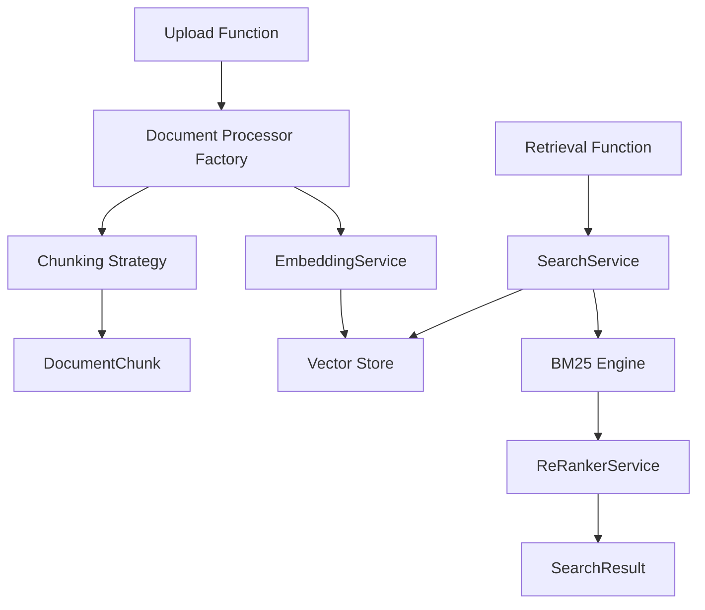

# Kore RAG

Kore RAG is a high-performance, serverless Retrieval-Augmented Generation (RAG) system. Designed for enterprise-grade intelligent document search, it enables the ingestion, processing, embedding, and querying of diverse document types using advanced AI-powered semantic understanding and hybrid retrieval strategies.

## Features

**Kore RAG** delivers:
- Multi-format document ingestion and intelligent chunking.
- Seamless vector embeddings using OpenAI and NVIDIA APIs.
- Hybrid search combining BM25 and vector similarity: query is scored by both methods, results are merged, then reranked for optimal relevance.
- Scalable Azure serverless backend.
- Secure API key access control.
- Monitoring and caching for robust operations.

## Goals

- **High-performance RAG**: Optimize retrieval accuracy through hybrid algorithms (vector + keyword).
- **AI-first search**: Embed and re-rank content with NVIDIA models for precise semantic relevance.
- **Flexible ingestion**: Handle PDF, DOCX, CSV, JSON, YAML, XML, Markdown, and Excel.
- **Security-first**: Ensure protected access via API key authentication and caching.
- **Cloud-native**: Azure Functions + ARM templates for autoscale and cost-effective deployments.

## Document Processing

### Multi-Format Document Processing

Supported formats:
- PDF, DOCX, XLSX, CSV
- JSON, YAML, XML, TXT
- Markdown

Chunking Strategies:
- Sentence-based
- Paragraph-based
- Token-based

## Intelligent Hybrid Search

- **Semantic Search** using OpenAI, NVIDIA and other providers vector embeddings.
- **Keyword Search** using BM25 scoring.
- **Re-Ranking** via NVIDIA APIs for better precision.
- **Search Function**: `/RetrievalFunction`

## Secure API Key

- API Key validation.
- Whitelisting support for IP-based restrictions.

## Upload & Manage Documents

- Upload via multipart form data.
- Automatic format detection and processing.

Functions:
- `/UploadFunction`
- `/DeleteFunction`
- `/CacheStatisticsFunction`

### 📡 Azure Native Deployment

- ARM templates for IaC-based deployments.
- Fully serverless architecture for horizontal scalability.
- Resilient service design with retry logic and logging.

## Architecture

