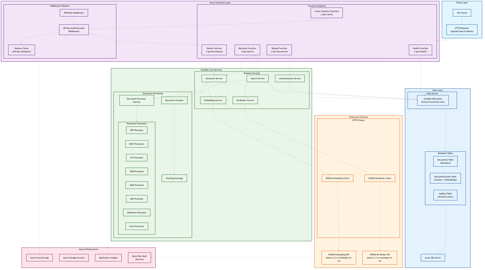

# Kore RAG

Kore RAG is a high-performance, serverless Retrieval-Augmented Generation (RAG) backend solution built with .NET 8 and Azure Functions. Designed for enterprise-grade intelligent document search, it enables the ingestion, processing, embedding, and querying of diverse document types using advanced AI-powered semantic understanding and hybrid retrieval strategies.



## 🚀 Overview

**Kore-FastRag** delivers:
- Multi-format document ingestion and intelligent chunking.
- Seamless vector embeddings using NVIDIA AI APIs.
- Hybrid search with BM25 + vector similarity.
- Scalable Azure serverless backend.
- Secure API key access control.
- Monitoring and caching for robust operations.

## 🧠 Goals

- **High-performance RAG**: Optimize retrieval accuracy through hybrid algorithms (vector + keyword).
- **AI-first search**: Embed and re-rank content with NVIDIA models for precise semantic relevance.
- **Flexible ingestion**: Handle PDF, DOCX, CSV, JSON, YAML, XML, Markdown, and Excel.
- **Security-first**: Ensure protected access via API key authentication and caching.
- **Cloud-native**: Azure Functions + ARM templates for autoscale and cost-effective deployments.

## ⚙️ Functional Features

### 🗃️ Multi-Format Document Processing

Supported formats:
- PDF, DOCX, XLSX, CSV
- JSON, YAML, XML
- Markdown

Chunking Strategies:
- Sentence-based
- Paragraph-based
- Token-based

> Processors implemented under `FastRAG.Core.Document.Processors`.

### 🔍 Intelligent Hybrid Search

- **Semantic Search** using NVIDIA vector embeddings.
- **Keyword Search** using BM25 scoring.
- **Re-Ranking** via NVIDIA APIs for better precision.
- **Search Function**: `/RetrievalFunction`

### 🔐 Secure API Key Authentication

- API Key validation middleware with memory caching.
- Whitelisting support for IP-based restrictions.
- Secure token persistence in SQL Server.

> Handled by `ApiKeyAuthenticationMiddleware`.

### 📥 Upload & Manage Documents

- Upload via multipart form data.
- Automatic format detection and processing.
- Persistent storage via `FastRAGDbContext`.

Functions:
- `/UploadFunction`
- `/DeleteFunction`
- `/CacheStatisticsFunction`

### 📡 Azure Native Deployment

- ARM templates for IaC-based deployments.
- Fully serverless architecture for horizontal scalability.
- Resilient service design with retry logic and logging.

## 🧱 Architecture Components

```mermaid
graph TD
    A[Upload Function] --> B[Document Processor Factory]
    B --> C[Chunking Strategy]
    C --> D[DocumentChunk]
    B --> E[EmbeddingService (NVIDIA)]
    E --> F[Vector Store (SQL Server)]
    G[Retrieval Function] --> H[SearchService]
    H --> F
    H --> I[BM25 Engine]
    I --> J[ReRankerService (NVIDIA)]
    J --> K[SearchResult]


🧑‍💼 Target Personas & Stories
| Persona              | Goal                                                       |
| -------------------- | ---------------------------------------------------------- |
| **Developer**        | Upload various document formats to build a knowledge base. |
| **System Admin**     | Secure the system with API keys.                           |
| **Data Analyst**     | Query documents using natural language.                    |
| **Content Manager**  | Delete obsolete documents from the corpus.                 |
| **DevOps Engineer**  | Deploy and monitor a cloud-scalable backend.               |
| **Application User** | Search documents with intelligent context awareness.       |

# 📦 Project Structure
├── FastRAG.sln
├── infra/
│   ├── azuredeploy.json
│   └── parameters.json
└── src/
    ├── FastRAG.Core/     # Business Logic
    │   ├── Clients/      # NVIDIA AI APIs
    │   ├── Data/
    │   ├── Document/
    │   ├── Dto/
    │   ├── Interfaces/
    │   ├── Models/
    │   └── Services/
    └── FastRAG.Function/ # Azure Functions
        ├── Functions/
        ├── Middleware/
        ├── Extensions/
        └── Configuration/

# 🧪 Key Interfaces & Services

| Interface                | Purpose                        |
| ------------------------ | ------------------------------ |
| `IDocumentService`       | Upload, delete, retrieve docs  |
| `ISearchService`         | Hybrid semantic/keyword search |
| `IEmbeddingService`      | Generate vector embeddings     |
| `IDocumentProcessor`     | Abstract multi-format parsing  |
| `IAuthenticationService` | API key validation logic       |

# 📊 Operational Monitoring

- Health Check: /HealthFunction
- Cache Metrics: /CacheStatisticsFunction
- Retry policies for API calls (e.g., NVIDIA endpoints).
- Memory caching for API key validation.

# 🧩 Requirement Fulfillment

| Requirement            | Fulfilled By                                |
| ---------------------- | ------------------------------------------- |
| Multi-format support   | Document processors                         |
| Intelligent chunking   | `DocumentChunker.cs`, `ChunkingStrategy.cs` |
| Secure API access      | Middleware, caching, key model              |
| Hybrid search          | `SearchService.cs`, NVIDIA                  |
| Serverless scalability | Azure Functions + ARM templates             |
| Observability          | Health function, cache metrics              |

# 📅 Future Enhancements

- 🔧 OpenTelemetry support
- 🔍 Query filters and faceted search
- 🌐 Frontend client for content managers
- 📁 Native ZIP support and nested file extraction

# 🏁 Conclusion
Kore-FastRag is a production-grade RAG backend solution designed for high-performance, scalable, and intelligent document search. With modular design, NVIDIA-powered semantic search, and Azure-native deployment, it brings enterprise-ready retrieval capabilities to modern knowledge-driven systems.
