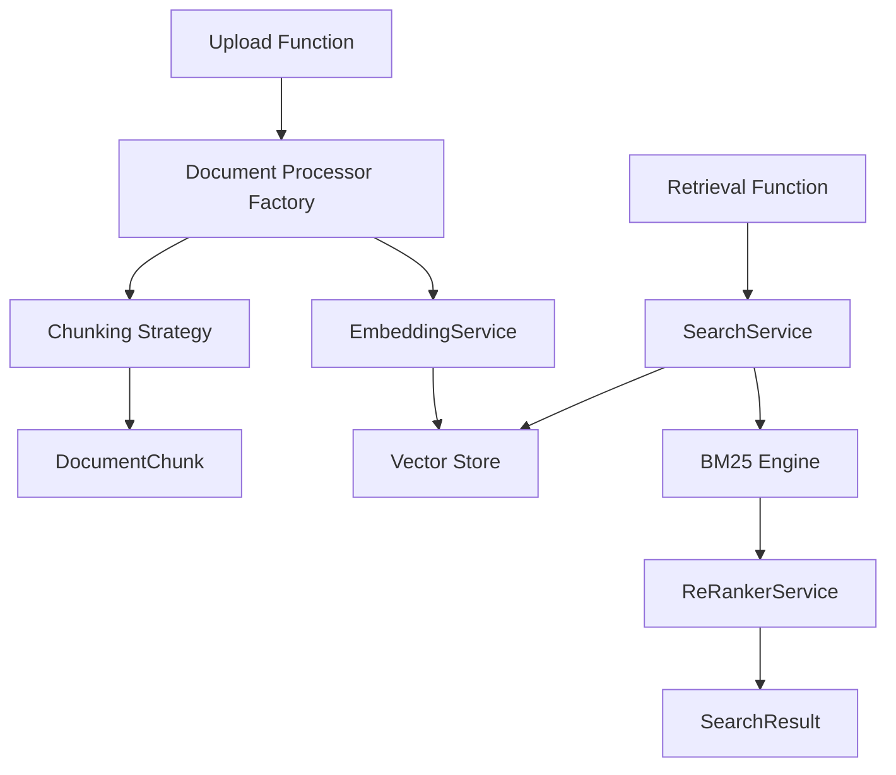

# Compass Agentic RAG

Compass Agentic RAG is a high-performance, serverless Retrieval-Augmented Generation (RAG) system, which orchestrates the knowledge synthesis process. Designed for enterprise-grade intelligent document search, it enables the ingestion, processing, embedding, and querying of diverse document types using advanced AI-powered semantic understanding and hybrid retrieval strategies.

## Goals

- **Agentic-first**: Engineered for seamless AI agent consumption, with humans in control of feeding and managing it.
- **High-performance**: Optimize retrieval accuracy through BM25, Vector and Hybrid algorithms.
- **AI-first search**: Embed and re-rank content with NVIDIA models for precise semantic relevance.
- **Security-first**: Ensure protected access.
- **Flexible ingestion**: Handle PDF, DOCX, CSV, JSON, YAML, XML, Markdown, and Excel.
- **Cloud-native**: Azure Functions + ARM templates for autoscale and cost-effective deployments.

## Features

**Compass Agentic RAG** delivers:
- Multi-format document ingestion and intelligent chunking.
- Seamless vector embeddings using NVIDIA and OpenAI models.
- Hybrid search combining BM25 and vector similarity: query is scored by both methods, results are merged, then reranked for optimal relevance.
- Scalable Azure serverless backend.
- Secure API key access control.
- Monitoring and caching for robust operations.

## Document Processing

### Understanding Your Data

Imagine Compass Agentic RAG as a brilliant librarian, but instead of just organizing books, Compass can read, understand, and categorize all sorts of documents – no matter their format! This is all thanks to Compass's incredible **Document Processing** capabilities.

At its heart, Document Processing is how Compass takes your raw information, whether it's a meticulously crafted report or a quick note, and turns it into something intelligent that it can work with. Think of it as Compass's way of "ingesting" knowledge.

### Multi-Format Document Processing

We know your information comes in all shapes and sizes, and Compass is built to handle that diversity effortlessly. No need to convert your files into a specific format just for Compass – chances are, we've got you covered!

Take a look at the wide range of formats Compass can seamlessly process:

* **Your Everyday Office Files:**
    * **PDF (.pdf):** Those universally shareable documents, perfect for reports, manuals, and presentations. Compass can dig into them!
    * **DOCX (.docx):** Your Microsoft Word documents – all your written content, ready for Compass to understand.
    * **XLSX (.xlsx):** Microsoft Excel spreadsheets – Compass can even make sense of your structured data, numbers, and tables.
    * **CSV (.csv):** Comma-separated values, often used for simple datasets. Compass handles these like a pro.

* **Developer & Structured Data Formats:**
    * **JSON (.json):** JavaScript Object Notation – a lightweight format often used for data exchange, especially in web applications. Compass speaks its language!
    * **YAML (.yaml):** Yet Another Markup Language – similar to JSON but often more human-readable, used for configuration files and data serialization.
    * **XML (.xml):** Extensible Markup Language – a classic for data structuring on the web and beyond. Compass's got a handle on it.
    * **TXT (.txt):** Simple, plain text files. Sometimes the simplest format holds the most valuable information, and Compass won't miss a beat.

* **Content Creation Formats:**
    * **Markdown (.md):** A lightweight markup language for creating formatted text using a plain-text editor. Perfect for documentation, notes, and even some web content. Compass understands its structure.

This extensive list means you can feed Compass almost any document you have, and it will intelligently process it, saving you time and effort from manual conversions. It's about letting you work with your data in the formats you're already familiar with!

### Chunking Strategies: Breaking Down Information for Better Understanding

Once Compass "reads" your document, it doesn't just treat it as one giant block of text. Instead, it intelligently breaks it down into smaller, manageable pieces. We call these pieces "chunks."

Why chunking? Think of it like this: if you were trying to understand a very long book, you wouldn't try to remember every single word on every single page at once. You'd break it down into chapters, then paragraphs, then sentences. Compass does something similar to ensure it accurately understands the context and meaning of your information.

Compass employs sophisticated **Chunking Strategies** to do this effectively:

* **Sentence-based:** This is exactly what it sounds like! Compass breaks your document into individual sentences. This is fantastic for detailed analysis where the meaning hinges on precise phrasing, allowing Compass to pinpoint specific statements or facts.

* **Paragraph-based:** For a broader understanding of ideas, Compass can chunk your document by paragraphs. This strategy helps Compass grasp complete thoughts or arguments presented within a single paragraph, useful for summarizing or understanding themes.

* **Token-based:** This is the most granular level. A "token" can be a word, a number, or even punctuation. When Compass chunks by tokens, it's breaking the document down into its absolute fundamental components. This is often used for highly technical analyses where every single piece of data, no matter how small, is crucial for accurate processing.

By using these different chunking strategies, Compass can optimize how it understands and works with your data, whether you need a high-level overview or a deep dive into the nitty-gritty details. It's all about making sure Compass processes your information in the most effective way possible to deliver the best results for you!

## Intelligent Hybrid Search

- **Semantic Search** using NVIDIA, OpenAI, and other vector embeddings providers.
- **Keyword Search** using BM25 scoring.
- **Re-Ranking** via NVIDIA APIs for better precision.
- **Search Function**: `/RetrievalFunction`

## Upload & Manage Documents

- Upload via multipart form data.
- Automatic format detection and processing.

Functions:
- `/UploadFunction`
- `/DeleteFunction`
- `/CacheStatisticsFunction`

### 📡 Azure Native Deployment

- ARM templates for IaC-based deployments.
- Fully serverless architecture for horizontal scalability.
- Resilient service design with retry logic and logging.

## Process flow

