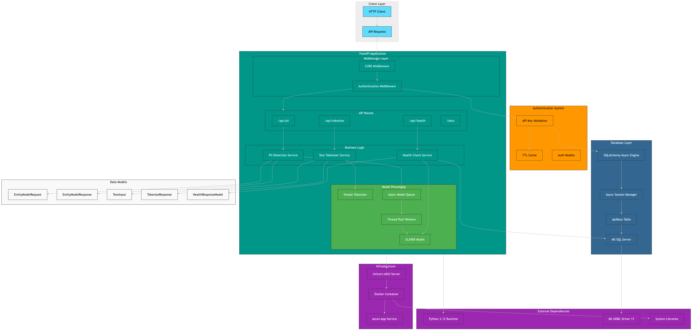

# Kore SLM

Kore SLM is a Python-based FastAPI web application offering enterprise-grade PII detection and tokenization services with secure, scalable cloud-native deployment.

<figure>

<figcaption>Architecture Diagram</figcaption>
</figure>

**Main Technologies:**

- **FastAPI**: High-performance API framework
- **GLiNER**: Named Entity Recognition model for PII
- **SQLAlchemy + aioodbc**: Async ORM for MS SQL Server
- **Docker + Azure App Service**: Cloud-native deployment
- **Azure DevOps Pipelines**: CI/CD automation

## 🧩 Module Breakdown

### Authentication (`api/authentication/`)

- API key validation
- TTL caching
- Pydantic models for auth data

### Models (`api/models/`)

- `pii.py`: GLiNER-based PII detection
- `tokenizer.py`: Advanced tokenization
- `models.py`: SQLAlchemy async DB models

### Core

- `main.py`: FastAPI entrypoint
- `defaults.py`: Configuration values
- `simple_tokenizer.py`: Basic tokenization

---

## 🔐 API Endpoints

### ✅ PII Detection

- **Endpoint**: `/api/pii/detect`
- **Method**: `POST`
- **Auth**: Bearer Token (API Key)

```json
{
  "text": "Sample input",
  "model_config": { /* optional */ }
}
```

### 🧠 Text Tokenization

- **Endpoint**: `/api/tokenize`
- **Method**: `POST`
- **Auth**: Bearer Token (API Key)

```json
{
  "text": "Some input text",
  "tokenizer_type": "simple"
}
```

### 🔍 Health Check

- **Endpoint**: `/health`
- **Method**: `GET`
- **Auth**: None

### 🔑 Authentication

- **Endpoint**: `/auth/validate`
- **Method**: `POST`
- **Auth**: None

```json
{
  "api_key": "your-api-key"
}
```

## 🧬 Data Structures & Interfaces

<figure>

<figcaption>Data model and interface layout</figcaption>
</figure>

## 🚀 Goals

- Automated PII detection (GLiNER)
- Secure, authenticated API access
- High-performance NLP/tokenization
- Azure cloud deployment via Docker
- Real-time processing + MS SQL persistence

## 👤 User Stories

- 🕵️‍♀️ **Data Privacy Officer**: Detect PII using GLiNER to stay compliant.
- 👨‍💻 **Developer**: Authenticate via API key + TTL caching.
- 🖥️ **SysAdmin**: Monitor service via health endpoints.
- 📊 **Data Analyst**: Tokenize text for NLP tasks.
- 🔧 **DevOps Engineer**: Deploy via Docker containers.
- 🏢 **Enterprise User**: Async processing + persistence.
- 🔒 **Security Admin**: Use CORS middleware for control.
- ☁️ **Cloud Architect**: CI/CD pipeline deployment on Azure.


## 📋 Requirement Analysis

The system aligns with functional and technical requirements:

- ✅ PII detection via GLiNER
- 🔐 API key authentication with TTL caching
- 🧠 Real-time text tokenization
- ⚡ Async DB (MS SQL) with SQLAlchemy + aioodbc
- 🚢 Azure container deployment (Docker + App Service)
- 🔁 CI/CD automation via Azure DevOps
- 🌐 CORS middleware for controlled access
- ⚙️ Uvicorn + FastAPI for REST performance

## 🛡️ Roadmap 

| Module | Recommendation |
|--------|----------------|
| `auth.py` | Add rate limiting, exponential backoff |
| `ttl_cache.py` | Implement LRU eviction |
| `pii.py` | Async model loading or background tasks |
| `models.py` | Add connection pooling |
| `main.py` | Restrict CORS origins |
| `simple_tokenizer.py` | Limit input size |
| `Dockerfile` | Use non-root user |
| `tokenizer.py` | Reuse tokenizer via DI |
| `defaults.py` | Validate env vars with fallbacks |


