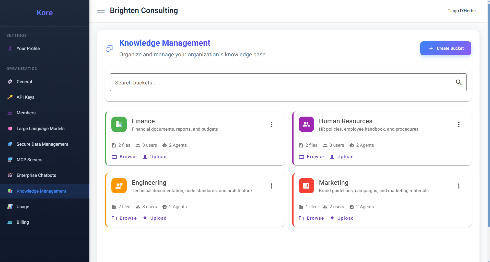
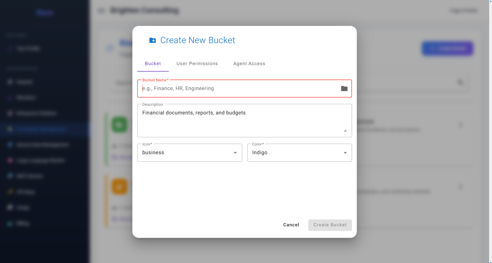
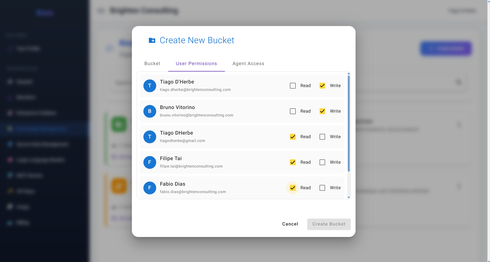
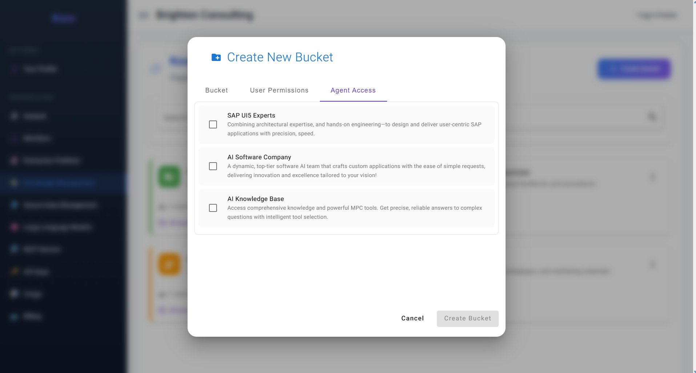
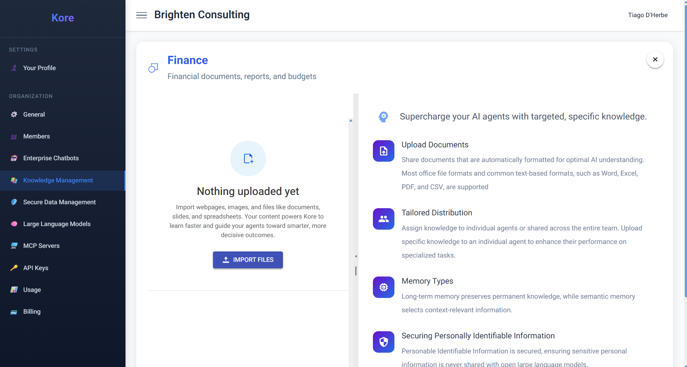

# **Building Your Enterprise's Collective Brainpower**

Kore's **Knowledge Management** features transcends traditional document repositories; it is the **central nervous system of your organisation's collective intelligence**. This is where raw data is transformed into accessible, actionable knowledge, empowering your AI agents and human teams to make smarter, faster, and more informed decisions.

As you can see in the **Knowledge Management dashboard**, Kore enables you to organise and manage your organisation’s knowledge base through intelligently designed "buckets."

*The Kore Knowledge Management dashboard, showcasing intelligent knowledge buckets.*

These buckets are essentially **secure, segregated silos of information**, acting as specialised brains for specific departments, projects, or topics – be it Finance, Human Resources, Engineering, or Marketing. Each bucket holds carefully curated knowledge that Enterprise Chatbots can then access, significantly augmenting their responses, increasing their certainty, and providing highly contextualised insights. The ability to segregate information as much as required is a cornerstone of Kore's design, ensuring data relevance and security.

**The Power of Granular Access Control: Information Segregation at its Finest**

A truly distinctive and crucial feature of Kore's Knowledge Management is its **granular access control**. This doesn't just apply to who can *read* or *write* to a knowledge bucket, but also to how that knowledge interacts with your deployed AI agents and the users leveraging them.

  * **Member-Level Permissions:** Kore provides the ability to set precise **Read** and **Write** permissions for individual members.
      * **Write Permissions:** Allow designated members to contribute new documents, files, and information to a particular bucket, ensuring that content is curated by the right experts.
      * **Read Permissions:** Dictate whether a member, when interacting with an Enterprise Chatbot, can utilise the information available within that specific bucket. This is a critical distinction: a member can still use a connected Enterprise Chatbot, but without the appropriate Read permission for a given bucket, the chatbot will *not* be able to scan or leverage the information within that particular silo for that specific user's query. This level of fine-grained control over information accessibility for end-users interacting with chatbots is a key feature not commonly available in other platforms, ensuring sensitive data is never inadvertently exposed.

### **Building the Organisational Brain: The "Create New Bucket" Journey**

Kore simplifies the process of creating and populating these intelligent knowledge silos through an intuitive "Create New Bucket" wizard.

**1. Bucket – Identifying Your Knowledge Core**

*Figure 10: The Bucket tab for defining your knowledge silo.*

This initial tab is where you define the core identity of your knowledge silo. You will assign a **Bucket Name** (e.g., "Finance," "HR," "Engineering") that clearly identifies the group of knowledge it will contain. A concise **Description** helps clarify its purpose, while customisable **Icon** and **Color** options allow for easy visual identification within the dashboard.

**2. User Permissions – Defining Human Collaboration**

*Figure 11: Setting individual user Read and Write permissions for the knowledge bucket.*

As detailed above, this critical tab is where your organisation precisely sets **Read** and **Write** permissions for individual members. This ensures that content contribution is controlled and that information access via chatbots is aligned with internal security policies and user roles.

**3. Agent Access – Empowering Your AI Collaborators**

*Figure 12: Granting Enterprise Chatbots access to the knowledge bucket.*

This tab is crucial for connecting your knowledge silos to your intelligent AI assistants. Here is presented the list of Kore built-in chatbots alongside your **Published and Released Enterprise Chatbots**. By simply checking a box next to a chatbot (e.g., "SAP UI5 Experts," "AI Software Company," "AI Knowledge Base"), your organisation explicitly grants that chatbot permission to access and utilise the information contained within this newly created bucket. This selective access ensures that your AI agents operate with precisely the right context and relevant information, maintaining control and preventing over-exposure of sensitive data.

### **Managing Bucket Files: Populating the Organisational Brain**

Once a bucket is created, populating it with valuable knowledge is seamless, leveraging Kore's robust document browser and powerful connectors. As shown in **Figure 13: Finance Knowledge Bucket - Upload Documents**, the "Import Files" option opens a world of possibilities for data ingestion.

*Figure 13: The Finance knowledge bucket, demonstrating various document upload methods.*

The document browser is a versatile tool that allows your organisation members to:

  * **Upload Files:** Ingest a wide variety of commonly known document formats, ensuring compatibility with your existing archives. This includes popular office file formats such as Word, Excel, PowerPoint, PDF, and common text-based formats like CSV.
  * **Upload Images:** Go beyond text\! Kore leverages advanced **image models** during the upload process to accurately describe the content of images, transforming visual information into structured data that AI agents can understand and utilise.
  * **Import Files from OneDrive:** Seamlessly pull in documents directly from your Microsoft OneDrive accounts.
  * **Link SharePoint Folders:** Connect entire SharePoint folders, ensuring that all their contents are automatically imported and kept in sync, creating a living knowledge base.
  * **Web Scrape Webpages and More:** Extend your knowledge base to external sources by providing URLs. Kore's agents will intelligently inspect, parse, and incorporate content from webpages, articles, and other online resources.

### **Intelligent Knowledge Distribution: Memory Types & PII Protection**

During the upload process, Kore offers crucial options for distributing knowledge and safeguarding sensitive information:

  * **Targeted Knowledge Distribution:** When uploading, you're presented with a dropdown to select which specific agent should have access to the knowledge. Alternatively, the **"Shared Knowledge"** option allows the document to be applied to all agents, providing universal access. This tailored distribution ensures that knowledge is applied efficiently and relevantly.
  * **Dual Memory System: Long-Term & Semantic Memory:** Kore supports two distinct types of memory to optimise knowledge retrieval:
      * **Long-Term Memory:** This type ensures knowledge is *always* available to an agent, acting as a foundational, persistent store of information.
      * **Semantic Memory:** This is the recommended type for most use cases, leveraging Kore's sophisticated **RAG engine**. Our high-performance, serverless **Retrieval-Augmented Generation (RAG) system** orchestrates the knowledge synthesis process, providing the best contextual information for a given step or task for the agents. Kore Agentic RAG was meticulously built with state-of-the-art techniques, combining **BM25** and **vector search** for highly relevant retrieval, complemented by super-fast embeddings and **reranking with OpenAI and NVIDIA** models for superior contextual understanding. *(For a deeper dive into its architecture and capabilities, please refer to the dedicated "Kore Agentic RAG" chapter).*
  * **Securing Personally Identifiable Information (PII):** During the upload process, organisation members can simply check an option to indicate if a document contains Personally Identifiable Information. When activated, Kore's system automatically identifies, extracts, and protects PII using **Kore SLM**. This ensures that sensitive personal data is never shared with open language models or inadvertently exposed, reinforcing compliance and privacy. *(For a detailed explanation of our robust PII handling and secure language model architecture, please refer to the dedicated "Kore SLM" chapter).*

By providing such comprehensive tools for knowledge creation, management, and secure distribution, Kore transforms your organisation's scattered information into a powerful, intelligent, and precisely controllable brain, ready to empower your AI agents and drive unparalleled productivity.

