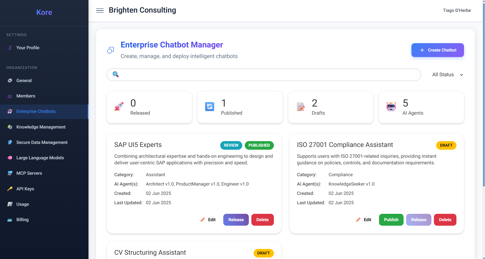
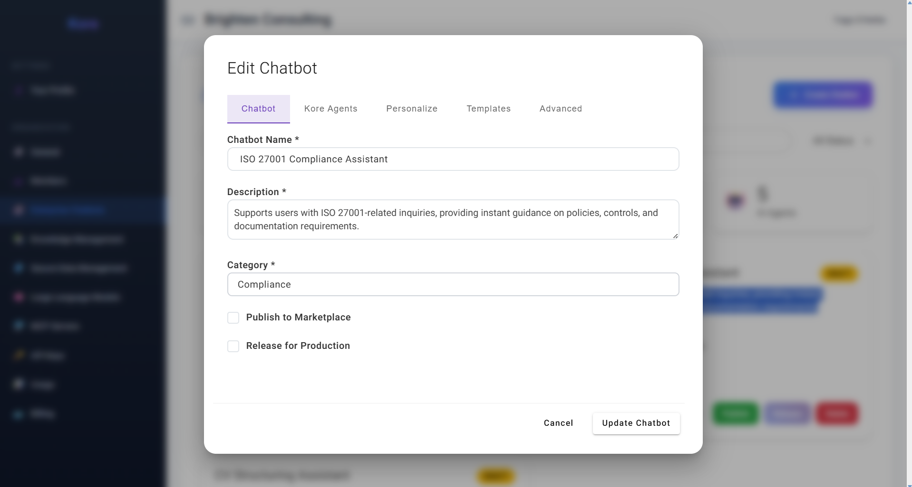
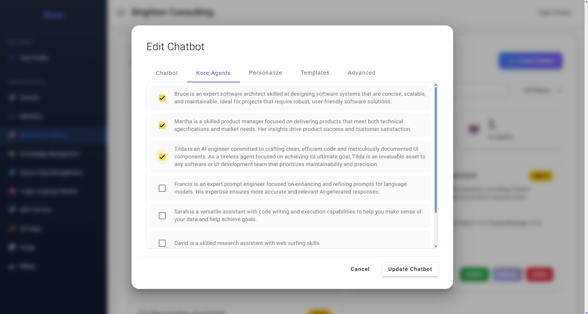
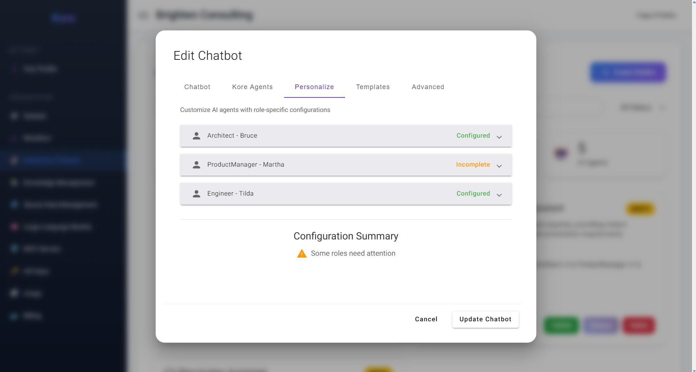
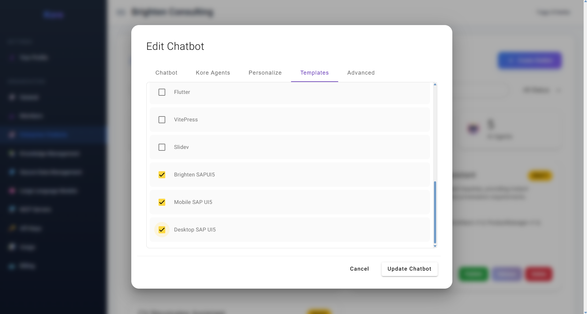
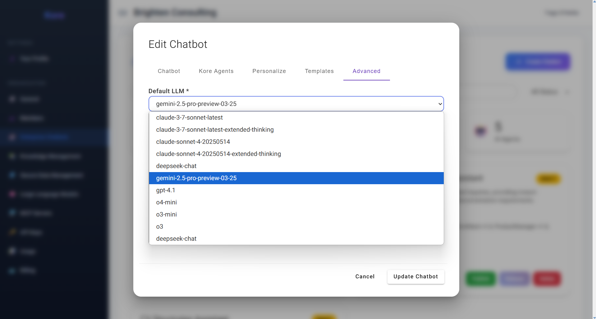

# Enterprise Chatbots

Kore's **Enterprise Chatbots** section provides your organisation with the robust tools to create, manage, and deploy intelligent chatbots, transforming how your teams interact with information and execute tasks. This capability moves beyond generic AI; it’s about crafting bespoke AI solutions that embody your organisation's unique knowledge, processes, and culture.

As depicted in the **Enterprise Chatbot Manager dashboard**, you gain a comprehensive overview of your chatbot portfolio, from conceptual drafts to fully deployed solutions.

*The Enterprise Chatbot Manager dashboard, showing deployed and drafted chatbots.*

Here, organisations can leverage existing Kore AI Agents to construct powerful, domain-specific chatbots. Imagine an internal expert system for SAP UI5 development, or a dedicated compliance assistant trained on proprietary standards – the possibilities are vast. For instance, an organisation heavily invested in SAP UI5 applications can create an **"SAP UI5 Experts"** chatbot. This powerful assistant would encapsulate the collective intelligence of the AI Software Team agents (Architect, Product Manager, Engineer), augmented with the organisation's own SAP UI5-specific project templates and best practice rules. Crucially, these chatbots can also be granted access to specific, secure knowledge bases, a topic we will delve into in a later section.

**The Lifecycle of an Enterprise Chatbot:**

Kore provides a clear, manageable lifecycle for your enterprise chatbots, ensuring controlled deployment and visibility:

  * **Draft Status:** When a chatbot is first created, it remains in `Draft` status (as seen with "ISO 27001 Compliance Assistant"). At this stage, it is not yet listed or accessible to users, allowing for iterative development and refinement.
  * **Published Status:** Once a chatbot is `Published` (indicated by the "REVIEW" status for "SAP UI5 Experts"), it means it's under review and becomes visible to users, but it is not yet fully accessible for new chat interactions. This stage is ideal for internal validation and stakeholder feedback.
  * **Released Status:** A `Released` chatbot (marked with "PUBLISHED" as seen for "SAP UI5 Experts") is fully active. It is listed to users, and they can initiate new chat sessions, leveraging its intelligence for their tasks.
  * **Archived Status:** Should a chatbot's utility expire or its function cease, it can be `Archived`. An archived chatbot is no longer listed or accessible to users, allowing for efficient resource management and decluttering of the active chatbot list.

## **Crafting an Enterprise Chatbot**
### A Step-by-Step Journey

Kore’s intuitive "Create Chatbot" wizard guides you through the process of configuring your custom AI assistant, offering granular control over its intelligence and persona.

**1. Chatbot – Defining Identity & Purpose**

*The Chatbot tab for initial chatbot definition.*

This initial tab is where you lay the foundational identity for your chatbot. You'll define its:

  * **Chatbot Name:** A clear, concise name that immediately conveys its purpose.
  * **Description:** A detailed explanation of what this chatbot does, its primary functions, and its intended audience.
  * **Category:** A classification (e.g., "Assistant," "Compliance," "Development") that helps users quickly identify its domain.
    These elements are crucial as they will be listed to your members, guiding them to select the most suitable chatbot for their specific task, ensuring clarity and efficiency. You also have options to "Publish to Marketplace" (for broader discovery within Kore's ecosystem) and "Release for Production" (for immediate operational readiness).

**2. Kore Agents – AI Building Blocks Behind the Bot**

*Selecting Kore AI Agents to form the chatbot's core intelligence.*

This is where you assemble the core intelligence of your chatbot. Kore is built on a multi-agent, multi-action framework, meaning you can select one or more of our powerful built-in AI agents to compose your chatbot. The combinations are virtually limitless, allowing you to create highly specialised or broadly capable assistants. As shown, you can select agents like:

  * **Bruce (Architect):** For designing robust systems.
  * **Martha (Product Manager):** For meticulous requirements analysis.
  * **Nova (Software Engineer):** For precise coding and implementation.
  * **Francis (Prompt Engineer):** For refining AI-generated responses.
  * **Sarah (Versatile Assistant):** For code writing and data interpretation.
  * **David (Research Assistant):** For web surfing and research.
  * **Albert (Knowlegde Assistante):** For deep knowledge exploration and accurate insights.
  * **Many more to come...**

By combining these expert agents, you can build a chatbot capable of tackling complex, multi-faceted problems.

**3. Personalize – Infusing Organisational Culture**

*Customising agent names and descriptions for unique chatbot personas.*

To foster a deeper connection and align with your organisation's culture, Kore allows you to personalise the AI agents that comprise your chatbot. In this tab, you can:

  * **Customize Display Names:** Rename agents (e.g., renaming "Architect - Bruce" to "Joule," as seen in the example).
  * **Tailor Descriptions:** Provide a unique description for each agent within this specific chatbot instance.
    This unique customisation creates a distinct persona for your chatbot, making it feel like an integral part of your team and enabling a seamless fit with your internal communications and branding.

The user interface displays a configuration summary indicating whether everything is properly validated or if certain fields require attention—such as missing text or text that is too short.

**4. Templates – Guiding Output with Structure & Best Practices**

*Selecting templates to guide chatbot output structure and content.*

This tab is pivotal for ensuring your chatbot's outputs are consistent, well-structured, and aligned with your organisation's standards. Kore provides a list of built-in stack templates, such as "Flutter," "VitePress," or various "SAP UI5" templates. A **stack template** represents a predefined folder structure with a specific set of files, often containing example documentation, boilerplate source code, or office file formats. These templates are crucial for:

  * **Guiding LLMs:** They provide the context and structure to best guide the underlying Large Language Models (LLMs) to produce content (whether documentation, source code, or office files) that is perfectly aligned with the final objective.
  * **Incorporating KoreRules:** Part of these templates are also `KoreRules` files. These contain best practices, "DOs and DON'Ts," and specific guidelines that can be individualised per each agent within the chatbot. This ensures that the generated content adheres to your enterprise's coding standards, architectural patterns, or documentation guidelines.
  * **Organisation-Specific Templates:** Crucially, as an organisation, you can **upload your own custom templates**, granting you full control and ensuring that the AI-generated output rigorously adheres to your unique internal standards and intellectual property.

**5. Advanced – Fine-Tuning AI Performance**

*Configuring advanced settings, including the default Large Language Model.*

The Advanced tab provides critical configurations to fine-tune the underlying AI behaviour of your chatbot. Here, you can specify settings such as the **Default LLM** (Large Language Model) that the chatbot will primarily use when a user creates a new chat. As shown in the dropdown, you can select from a range of powerful models (e.g., `claude-3-7-sonnet-latest`, `gemini-2.5-pro-preview-03-25`, `gpt-4.1`), allowing you to optimise for cost, performance, or specific model capabilities. This flexibility ensures your chatbot is always running on the most suitable and performant AI foundation for its designated tasks.

By providing these extensive configuration options, Kore ensures that your Enterprise Chatbots are not just intelligent, but also perfectly tailored to your organisational needs, secure, and ready to deliver transformative value across your entire business.