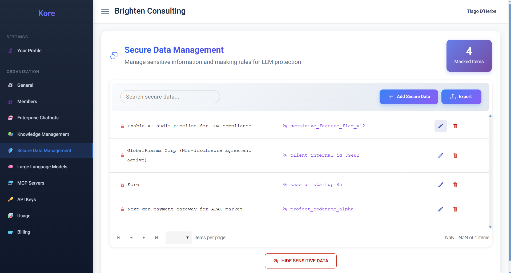
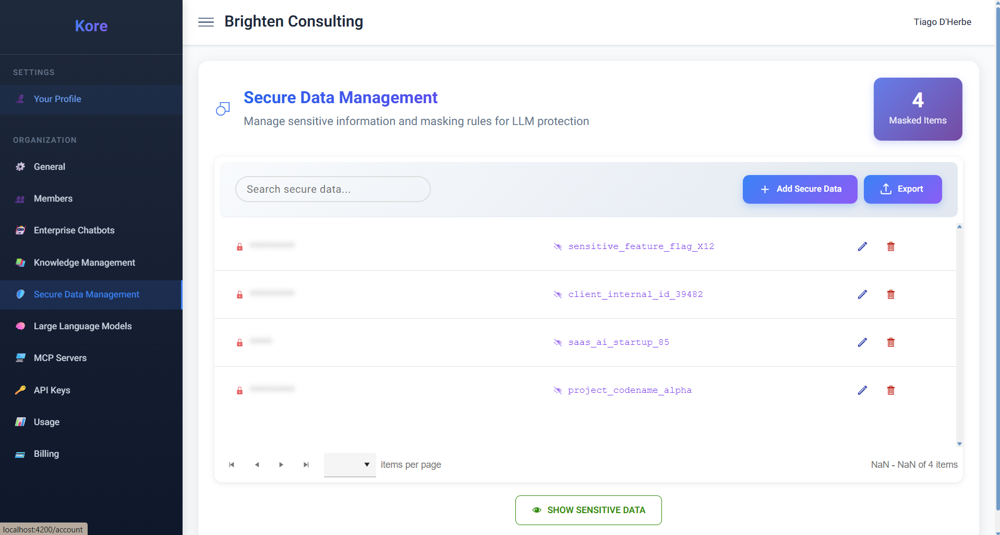
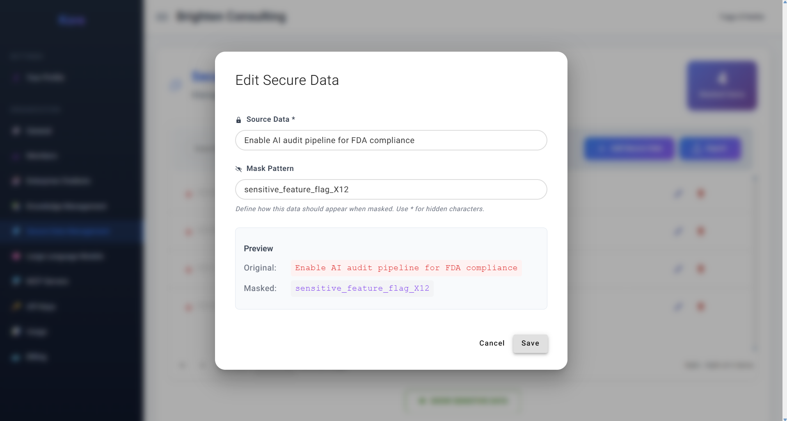

# **Shielding Enterprise Secrets in the AI Era**

As organisations increasingly integrate AI into their core operations, the challenge lies in leveraging the immense power of public or open LLMs (such as Google's Gemini, OpenAI's GPT, DeepSeek, and others) without compromising confidentiality. Kore's **Secure Data Management** feature is engineered precisely for this challenge, providing an impenetrable shield for your most critical information.

As you navigate the **Secure Data Management**, you'll see a clear overview of your masked items, representing the sensitive data points Kore is actively protecting within your AI workflows.

*Figure 14: Secure Data Management, showing masked items for LLM protection.*

This sophisticated capability allows organisations to dynamically **mask sensitive or confidential information** – be it customer names, internal project codenames, strategic financial figures, or highly confidential organisational secrets. Kore ensures that this crucial, super-secretive enterprise data can securely transit between your internal systems and external LLMs, **never disclosing the real information** to the model.

**The Core Principle: Confidentiality Without Compromise**

The beauty of Kore's Secure Data Management lies in its transparent yet robust protection. For your organisation's members, the experience is seamless and completely transparent: they will always read and view information as it was originally intended, whether it’s generated by an AI agent or displayed within the Kore platform. The intricate obfuscation process **occurs solely at the AI interaction level**, ensuring data integrity for human users while guaranteeing privacy during LLM processing. This means your teams get high-value, accurate results from the AI without ever exposing the underlying sensitive data to the LLM itself.

**Visualising Protection in Action:**

Even within the Kore user interface, the commitment to security is evident. By default, the view intelligently secures the most important organisation-valued secrets by obfuscating them, as seen in **Figure 15: Secure Data Management - Obfuscated View**. A simple toggle allows authorised users to "Show Sensitive Data" when required for specific management tasks.

*Figure 15: Secure Data Management, showing obfuscated sensitive data for enhanced privacy.*

**Effortless Management of Your Enterprise Secrets:**

Kore makes the process of safeguarding your data intuitive and manageable:

  * **Simple Secret Definition:** To add or edit a sensitive data point, you simply access a dedicated form, as shown in **Figure 16: Edit Secure Data**. Here, you input the `Source Data` (your actual secret, e.g., "Enable AI audit pipeline for FDA compliance") and define the `Mask Pattern` (how it should appear when hidden, e.g., "sensitive\_feature\_flag\_X12").
  * **Real-time Masking Preview:** For user convenience and accuracy, a **real-time preview** of the masking process is presented during creation or editing. This allows you to immediately verify that your sensitive data will be correctly obfuscated according to your specified pattern before it's applied across the system.

*Figure 16: The Edit Secure Data interface, demonstrating the source data and mask pattern preview.*

  * **Comprehensive Coverage:** You can confidently add all your organisation's critical secrets, codenames, and sensitive combinations here, assured that Kore will protect your information while enabling high-value results from your AI workflows.
  * **Secure Export Functionality:** For authorised users requiring offline review or backup, an "Export" function is available. This allows you to securely export all your defined organisation secrets to a file, providing an additional layer of data management and compliance.

By providing robust secure data management, intelligent masking, and PII securing compliance, Kore empowers enterprises to confidently embrace the power of AI, fostering innovation without ever compromising the privacy and security of their most valuable assets. Your secrets remain yours, even when interacting with the world's most advanced LLMs.
