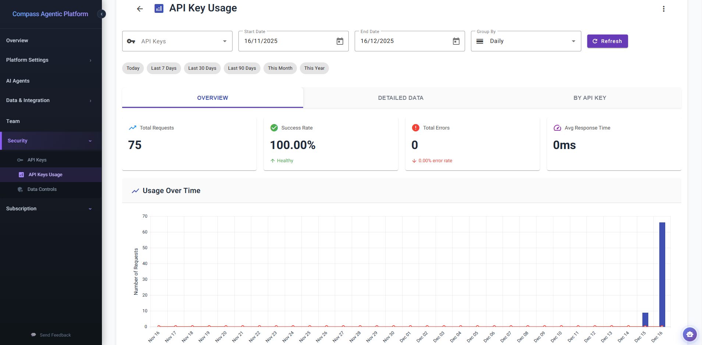

# **Securely Extending Compass's Across Your Enterprise**

> ### How to Get Your API Key
>
> Follow these simple steps to obtain your API key:
>
> 1.  **Login to Compass:** Access your Compass account.
> 2.  **Navigate to Organization > API Key:** In the left-hand navigation, select "Organization" then "API Key."
> 3.  **Generate Key:** Click the "Create New Key" button and follow the prompts.
> 4.  **Get API Key:** Your newly generated API key will be displayed. Copy and save it securely.

In today's interconnected digital landscape, the ability to securely integrate and extend platform functionalities is paramount for enterprise innovation. Compass's **API Keys** section within the Organization admin dashboard provides you with the essential toolkit to manage these critical credentials, enabling your organisation to seamlessly connect external applications and custom solutions to Compass's ecosystem.

As displayed in the **API Keys dashboard**, you gain an immediate, intuitive overview of all your organisation's API keys, their status, and easy management options.

*API Keys management and status.*

Think of Compass's API keys as digital passports, granting authorised external applications permission to interact with your Compass organisation on your behalf. This is incredibly powerful for custom development. Imagine your team building a bespoke internal application specifically designed to streamline ISO 9001 compliance, leveraging the deep expertise of your "ISO 9001 Chatbot". When your users configure this custom application, they'll securely connect to Compass using a specific API key that's been designated for this purpose, ensuring authorised and controlled access to that particular enterprise chatbot and its connected knowledge buckets.

## **Widgets & Integrations**

An API key can be used in conjunction with various Compass widgets and integrations to extend functionality and enhance productivity:

  * **Chat Widget (embeddable script):** Easily integrate a Compass Chat into any website using an embeddable script.
  * **Compass CLI:** A powerful developer tool for maximum productivity, seamlessly integrated with your IDE.
  * **Compass Excel Add-in:** Build and work with Excel spreadsheets using natural language directly within Excel.

**Unparalleled Ease and Flexibility in Key Management:**

Compass prioritises both security and operational simplicity when it comes to API key management:

  * **Effortless Creation:** With a prominent "Create New Key" button, generating a new API key is incredibly straightforward. This allows your teams to quickly provision credentials for new projects, integrations, or development cycles, without bureaucratic delays.
  * **Dynamic Invalidation and Rotation for Enhanced Security:** Compass provides a robust mechanism to **invalidate** keys instantly. This is crucial for security best practices, allowing you to immediately revoke access if a key is compromised, a project concludes, or a team member departs. Furthermore, the system is designed to facilitate **key rotation**, a vital security measure that involves regularly changing API keys to minimise the window of vulnerability, even if a key is not known to be compromised. This proactive approach ensures your integrations remain resilient against potential threats.
  * **Transparent Status & Visibility:** The dashboard offers clear indicators for **Total Keys, Active Keys, and Inactive Keys**, providing a quick snapshot of your API footprint. You can easily filter keys by their status, ensuring you always have a clear understanding of your active integrations. While the full API key strings are securely obfuscated by default for display (as indicated by the asterisks), authorised users can easily "Show" the key details when needed for configuration or verification.
  * **Granular Control & Traceability:** Each API key can be named descriptively (e.g., "Production API," "Development API," "ISO 9001 Chatbot (SAPUI5)"), allowing for clear identification of its purpose. This level of granularity ensures that you can manage access precisely, understanding which external applications are connecting for what purpose.

**Driving Enterprise Agility with Secure Connectivity:**

The ability to manage API keys with such ease and flexibility offers immense benefits to your organisation:

  * **Enabling Custom Solutions:** Empower your development teams to build bespoke applications and integrations that seamlessly leverage Compass's AI agents, knowledge bases, and chatbots, perfectly tailored to your unique workflows.
  * **Secure Third-Party Integration:** Confidently connect Compass to your existing third-party business intelligence tools, reporting dashboards, or automation platforms, knowing that access is controlled and secure.
  * **Streamlined DevOps:** Facilitate continuous integration and continuous delivery (CI/CD) pipelines by providing automated systems with secure API access to Compass for tasks like code generation, documentation updates, or knowledge base synchronisation.
  * **Enhanced Auditability:** The clear status and naming conventions of API keys contribute to better auditability, helping you track and manage your AI interactions across the enterprise.

By providing intuitive yet powerful API key management, Compass ensures that your organisation can securely extend its AI capabilities, fostering an environment of innovation, integration, and controlled access.

---

## **Usage Dashboard**

### Transform Usage Data into Strategic Insights
Beyond simply creating and managing API keys, Compass empowers organisations with sophisticated **usage analytics** through its comprehensive **API Key Usage Dashboard**. This enterprise-grade monitoring solution transforms raw API interaction data into actionable intelligence, enabling you to optimise performance, ensure compliance, troubleshoot issues proactively, and make data-driven decisions about your AI infrastructure investments.

*Real-time analytics and usage monitoring for API keys.*

### **The Power of Usage Intelligence**

Understanding how your API keys are being utilised across your organisation is critical for several strategic reasons:

  * **Performance Optimisation:** Identify usage patterns, peak demand periods, and response time trends to optimise resource allocation and ensure your integrations perform at their best.
  * **Cost Management & Forecasting:** Track request volumes over time to accurately forecast usage trends, enabling better budget planning and preventing unexpected costs.
  * **Security & Anomaly Detection:** Monitor for unusual spikes in requests or elevated error rates that may indicate security concerns, misconfigured applications, or compromised credentials.
  * **Compliance & Auditability:** Maintain comprehensive records of API usage for regulatory compliance, internal audits, and demonstrating responsible AI governance.
  * **Development & Debugging:** Quickly identify and troubleshoot integration issues by analysing error rates, success rates, and response times for specific API keys.
  * **Stakeholder Reporting:** Generate professional visualisations and detailed reports to communicate the value and adoption of your Compass integrations to leadership.

### **Comprehensive Analytics at Your Fingertips**

The API Key Usage Dashboard is meticulously designed to provide multiple analytical perspectives, each optimised for different insights and use cases:

#### **1. Intelligent Filtering & Time-Based Analysis**

Access your data exactly how you need it with sophisticated filtering capabilities:

  * **Multi-Key Selection:** Analyse individual API keys, compare multiple keys simultaneously, or view aggregate usage across all keys. Perfect for understanding which integrations are driving the most value or identifying underutilised keys.
  * **Flexible Date Ranges:** Define precise analysis periods with intuitive start and end date pickers that include smart validation to prevent invalid date ranges.
  * **Quick Range Shortcuts:** Instantly access pre-configured time windows with a single click:
    - **Today:** Real-time monitoring of current activity
    - **Last 7 Days:** Weekly performance tracking and trending
    - **Last 30 Days:** Monthly usage patterns and billing cycle analysis
    - **Last 90 Days:** Quarterly trends for strategic planning
    - **This Month:** Current month-to-date performance
    - **This Year:** Annual usage overview and year-over-year comparisons
  * **Temporal Granularity Control:** Switch seamlessly between **Daily** and **Monthly** aggregation modes to zoom from micro-level detail to macro-level trends, adapting your analysis to match your questions.
  * **Real-Time Refresh:** Update your dashboard on-demand with a single click, ensuring you always have access to the latest data when making critical decisions.

#### **2. Overview Tab: Executive Dashboard with Key Performance Indicators**

The Overview tab presents a high-level health check of your API ecosystem through four carefully selected KPIs and dynamic visualisations:

**Critical Performance Metrics:**

  * **Total Requests:** Track the aggregate volume of API calls across your selected keys and time period. This metric serves as your primary indicator of integration adoption and usage intensity, with clear trending visualisation to understand growth trajectories.

  * **Success Rate:** Monitor the reliability of your integrations with percentage-based success tracking. Compass provides intelligent health assessment, automatically flagging success rates below 95% with a "Needs Attention" indicator while celebrating **healthy** performance (≥95%) with positive reinforcement. This proactive alerting enables you to address reliability issues before they impact users.

  * **Total Errors:** Stay informed about integration failures with comprehensive error counting and automatic error rate calculation. The dashboard colour-codes this metric in attention-grabbing red, ensuring critical issues are immediately visible. Understanding your error rate helps prioritise debugging efforts and measure improvement over time.

  * **Average Response Time:** Assess the performance characteristics of your integrations with millisecond-precision response time tracking. This metric is crucial for understanding user experience quality and identifying potential bottlenecks that may require optimisation.

**Interactive Usage Visualisation:**

The centrepiece of the Overview tab is a sophisticated **dual-series time chart** that brings your usage data to life:

  * **Column Chart (Requests):** Visualise request volumes as elegant blue columns, making it immediately apparent which days or months experienced the highest activity. The visual weight of each column corresponds to usage intensity, creating an intuitive understanding of demand patterns.

  * **Line Chart (Errors):** Overlaid as a smooth red line with visible markers, error tracking allows you to instantly correlate error spikes with specific time periods or request volumes. The contrasting visual style ensures errors never go unnoticed.

  * **Adaptive Time Axis:** The chart intelligently adapts to your selected grouping mode. In daily view, dates are presented with rotated labels for optimal readability even across extended periods. In monthly view, the axis displays clear month labels for long-term trend analysis.

  * **Interactive Tooltips:** Hover over any data point to reveal contextual information including the specific date/month, metric name, and precise values with proper number formatting.

  * **Professional Export Options:** Share insights with stakeholders by exporting the chart in publication-quality formats:
    - **PNG Export:** Perfect for presentations, reports, and dashboards requiring bitmap graphics
    - **SVG Export:** Ideal for print materials, scalable graphics, and professional documentation

#### **3. Detailed Data Tab: Granular Analysis with Enterprise Grid**

When you need to dive deep into the numbers, the Detailed Data tab provides a powerful, enterprise-grade data grid with sophisticated analytical capabilities:

**Comprehensive Data Columns:**

  * **Date:** Every usage record timestamped with medium-date formatting for clarity
  * **API Key:** Identification of which specific key generated the activity, with "All Keys" aggregation when viewing combined data
  * **Requests:** The volume of API calls, prominently displayed with bold formatting and thousands separators for easy reading
  * **Errors:** Error counts with intelligent visual enhancement—error icons appear alongside non-zero values, and the entire cell is colour-coded in red to draw immediate attention
  * **Success Rate:** A stunning visual progress bar fills dynamically based on the success percentage, with colour coding (green for excellent, amber for warning, red for critical) and a precise numeric label showing the exact rate

**Advanced Grid Capabilities:**

  * **Multi-Level Sorting:** Click any column header to sort ascending, click again for descending, or click a third time to remove sorting. Hold shift to build multi-column sorts (e.g., sort by date then by requests) for complex analysis.

  * **Menu-Based Filtering:** Each column features sophisticated filtering options appropriate to its data type. Numeric columns support range filters, date columns provide date-specific operators, and text columns offer contains/equals/starts with logic.

  * **Intelligent API Key Filter:** The API Key column features a custom multi-select filter that displays all unique key names in your dataset. Select multiple keys to focus your analysis, with autocomplete search and clear buttons for efficient navigation.

  * **Flexible Pagination:** Navigate large datasets effortlessly with configurable page sizes (10, 20, 50, or 100 records per page), numbered page buttons, previous/next navigation, and an information display showing your current position (e.g., "1-20 of 150 items").

  * **Column Reordering:** Drag and drop columns to match your preferred analysis workflow, personalising the dashboard to your needs.

  * **Resizable Columns:** Adjust column widths dynamically by dragging column borders, ensuring you can view long key names or accommodate different screen sizes.

  * **Excel Export:** With a single toolbar click, export your entire filtered and sorted dataset to Excel format (.xlsx), perfect for further analysis in spreadsheet tools, archival purposes, or sharing with teams who prefer traditional data formats.

#### **4. By API Key Tab: Individual Key Performance Profiles**

The By API Key tab takes a key-centric perspective, presenting individual performance cards for each API key in your analysis:

**Individual Key Cards Display:**

Each API key receives its own dedicated card showing:

  * **Key Identification:** Clear display of the API key's descriptive name (as configured during creation)
  * **Total Requests:** Cumulative request count across the selected time period, formatted with thousands separators
  * **Error Count:** Highlighted in red for visibility, showing the total number of failed requests
  * **Last Used Timestamp:** When present, displays the most recent usage date and time with short date formatting, helping you identify dormant keys or verify active integrations

**Strategic Value:**

This tab is particularly valuable for:

  * **Key Comparison:** Quickly compare the relative usage and reliability of different integrations
  * **Identifying Inactive Keys:** Spot keys that haven't been used recently, which may be candidates for deactivation to reduce security surface area
  * **Per-Integration Health Checks:** Assess whether specific integrations are experiencing elevated error rates
  * **Usage Distribution Analysis:** Understand which integrations are driving the most demand on your Compass organisation

**Empty State Handling:** When no key-specific data is available for your selected filters, the dashboard presents a helpful empty state message, preventing confusion and guiding you to adjust your analysis parameters.

### **Operational Excellence Through Visibility**

The API Key Usage Dashboard transforms how organisations operate their Compass integrations:

**Proactive Issue Resolution:**

Instead of waiting for users to report integration failures, DevOps teams can monitor success rates and error counts in real-time, identifying and resolving issues before they impact productivity. The colour-coded health indicators and visual alerts ensure nothing slips through the cracks.

**Data-Driven Resource Allocation:**

Understanding usage patterns enables IT leadership to make informed decisions about infrastructure scaling, API rate limit planning, and resource allocation. Visualising peak usage periods helps schedule maintenance windows during low-activity times.

**Compliance Documentation:**

Regulatory frameworks increasingly require organisations to maintain audit trails of AI system usage. The detailed data export capabilities provide comprehensive records that can be archived or presented to auditors, demonstrating responsible governance.

**Developer Productivity:**

Development teams building custom integrations can use the dashboard to monitor their API keys during development and testing phases, ensuring their implementations are efficient and error-free before production deployment. Response time metrics help identify performance optimisation opportunities.

**Executive Reporting:**

The visual export capabilities transform technical usage data into compelling executive presentations. Share PNG or SVG charts in board presentations to demonstrate integration adoption, justify AI platform investments, or communicate the strategic value of your Compass deployment.

**Cost Optimisation:**

By identifying underutilised API keys or integrations with excessive request volumes, organisations can optimise their Compass usage patterns, potentially adjusting licensing or consolidating redundant integrations to maximise return on investment.

## **A Complete Lifecycle**

### **From Creation to Intelligence**

Compass's API key capabilities represent a complete lifecycle management solution. You begin by **creating** keys with descriptive names and clear purposes. You maintain **security** through dynamic invalidation and rotation. And now, with the **API Key Usage Dashboard**, you gain continuous **intelligence** about how those keys perform in the real world.

This closed-loop approach ensures that API keys aren't just credentials—they're strategic assets backed by data, monitored for health, and optimised for maximum organisational value. Whether you're a security professional ensuring compliance, a developer troubleshooting an integration, or an executive evaluating AI platform ROI, the API Key Usage Dashboard provides the visibility you need to succeed.

By combining intuitive management with sophisticated analytics, Compass empowers organisations to not just extend their AI capabilities securely, but to do so with full visibility, confidence, and strategic insight.
