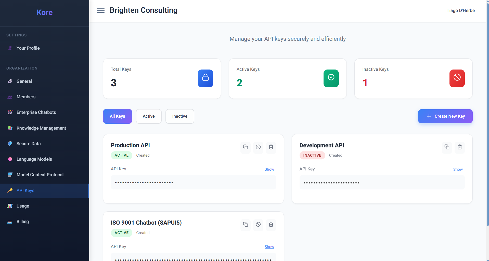

# **Securely Extending Compass's Across Your Enterprise**

In today's interconnected digital landscape, the ability to securely integrate and extend platform functionalities is paramount for enterprise innovation. Compass's **API Keys** section within the Organization admin dashboard provides you with the essential toolkit to manage these critical credentials, enabling your organisation to seamlessly connect external applications and custom solutions to Compass's ecosystem.

As displayed in the **API Keys dashboard**, you gain an immediate, intuitive overview of all your organisation's API keys, their status, and easy management options.

*API Keys management and status.*

Think of Compass's API keys as digital passports, granting authorised external applications permission to interact with your Compass organisation on your behalf. This is incredibly powerful for custom development. Imagine your team building a bespoke internal application specifically designed to streamline ISO 9001 compliance, leveraging the deep expertise of your "ISO 9001 Chatbot". When your users configure this custom application, they'll securely connect to Compass using a specific API key that's been designated for this purpose, ensuring authorised and controlled access to that particular enterprise chatbot and its connected knowledge buckets.

**Unparalleled Ease and Flexibility in Key Management:**

Compass prioritises both security and operational simplicity when it comes to API key management:

  * **Effortless Creation:** With a prominent "Create New Key" button, generating a new API key is incredibly straightforward. This allows your teams to quickly provision credentials for new projects, integrations, or development cycles, without bureaucratic delays.
  * **Dynamic Invalidation and Rotation for Enhanced Security:** Compass provides a robust mechanism to **invalidate** keys instantly. This is crucial for security best practices, allowing you to immediately revoke access if a key is compromised, a project concludes, or a team member departs. Furthermore, the system is designed to facilitate **key rotation**, a vital security measure that involves regularly changing API keys to minimise the window of vulnerability, even if a key is not known to be compromised. This proactive approach ensures your integrations remain resilient against potential threats.
  * **Transparent Status & Visibility:** The dashboard offers clear indicators for **Total Keys, Active Keys, and Inactive Keys**, providing a quick snapshot of your API footprint. You can easily filter keys by their status, ensuring you always have a clear understanding of your active integrations. While the full API key strings are securely obfuscated by default for display (as indicated by the asterisks), authorised users can easily "Show" the key details when needed for configuration or verification.
  * **Granular Control & Traceability:** Each API key can be named descriptively (e.g., "Production API," "Development API," "ISO 9001 Chatbot (SAPUI5)"), allowing for clear identification of its purpose. This level of granularity ensures that you can manage access precisely, understanding which external applications are connecting for what purpose.

**Driving Enterprise Agility with Secure Connectivity:**

The ability to manage API keys with such ease and flexibility offers immense benefits to your organisation:

  * **Enabling Custom Solutions:** Empower your development teams to build bespoke applications and integrations that seamlessly leverage Compass's AI agents, knowledge bases, and chatbots, perfectly tailored to your unique workflows.
  * **Secure Third-Party Integration:** Confidently connect Compass to your existing third-party business intelligence tools, reporting dashboards, or automation platforms, knowing that access is controlled and secure.
  * **Streamlined DevOps:** Facilitate continuous integration and continuous delivery (CI/CD) pipelines by providing automated systems with secure API access to Compass for tasks like code generation, documentation updates, or knowledge base synchronisation.
  * **Enhanced Auditability:** The clear status and naming conventions of API keys contribute to better auditability, helping you track and manage your AI interactions across the enterprise.

By providing intuitive yet powerful API key management, Compass ensures that your organisation can securely extend its AI capabilities, fostering an environment of innovation, integration, and controlled access.
