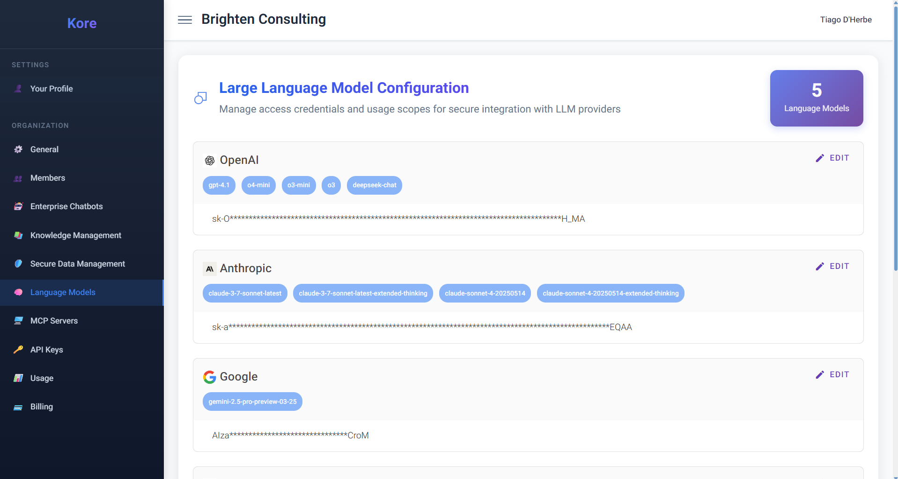
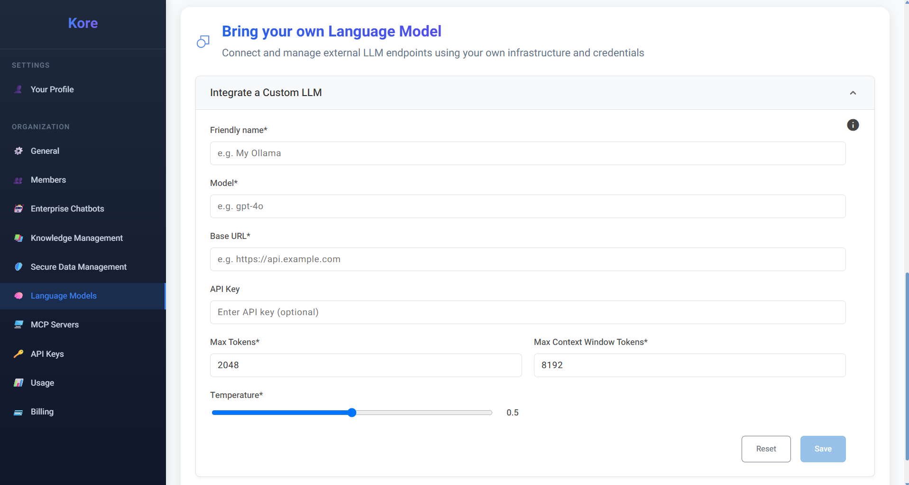

# **Orchestrating AI Intelligence**

At the very core of Compass's powerful AI capabilities lies its seamless integration with a diverse ecosystem of Large Language Models (LLMs).

The **Language Models** page within the Organization admin dashboard is your command centre for managing these critical AI resources, providing the account owner with the granular control needed to fuel your organisation's AI agents with the perfect intelligence.

Compass offers a clear, organised overview of the LLM providers integrated into your **Compass** platform.

*Language Model Configuration, supported LLM providers and models.*

**Compass** prides itself on its extensive support for all the major LLM providers and many of their latest, most advanced models. This includes industry leaders such as **OpenAI (e.g., `gpt-4.1`, `o4-mini`, `o3-mini`, `o3`), Google (e.g., `gemini-2.5-pro-preview-03-25`), Anthropic (e.g., `claude-3-7-sonnet-latest`, `claude-sonnet-4-20250514`), Azure, DeepSeek, Mistral, and xAI**.

Our commitment is to ensure your organisation always has access to state-of-the-art AI.

It's important to note that as new, more performant models are released, **Compass** may update its support to prioritise the latest versions, especially in cases where maintaining older, redundant models becomes ubiquitous.

We are always working diligently to keep our LLM support up-to-date with the models we internally test, validate results, and deem most beneficial for enterprise use cases.

## **Bring Your Own Key**
### Security and Flexibility

A fundamental principle of Compass's LLM integration is flexibility and control. The screen prominently allows the account owner to **bring their own API keys** for these commercial LLM providers. This means your organisation maintains direct ownership and management of its LLM usage, billing, and data policies with the respective providers, while seamlessly leveraging their power within the secure Compass environment. Your credentials are encrypted and remain private, securely managed within Compass.

## **Integrating Private LLMs**

**Compass** goes a significant step further in providing unparalleled flexibility by supporting integration with **private and custom LLMs**. This is a game-changer for organisations with specific security requirements, proprietary models, or those who prefer to host LLMs on their own infrastructure for cost control or data locality.

Whether your custom model is a fine-tuned version of an open-source model on **HuggingFace**, a locally run instance via **Ollama**, or a large-scale deployment hosted on cloud infrastructure like **AWS**, Compass enables you to seamlessly incorporate it into your AI ecosystem.

**The "Bring Your Own Language Model" Process**

*"Bring Your Own Language Model" interface for custom LLM integration.*

The process of registering your custom LLM is intuitive and detailed, ensuring precise control over its behaviour:

  * **Friendly Name:** Assign a memorable `Friendly name` (e.g., "My Ollama") for easy identification within Compass.
  * **Model:** Specify the actual `Model` identifier (e.g., "gpt-4o," "llama2-70b") that Compass will use to refer to your custom LLM.
  * **Base URL:** Provide the `Base URL` of your LLM's API endpoint (e.g., `https://api.example.com`). This is how Compass's agents will communicate with your self-hosted or custom service.
  * **API Key (Optional):** If your custom LLM endpoint requires authentication, you can securely enter the `API Key` here.
  * **Max Tokens & Max Context Window:** These critical parameters define the operational boundaries of your model:
      * `Max Tokens`: The maximum number of tokens your model can generate in a single response.
      * `Max Context Window`: The total number of tokens (input + output) that the model can process within a single conversation turn or prompt. Accurately setting these ensures optimal performance and prevents out-of-memory errors for the LLM.
  * **Temperature:** This slider controls the `Temperature` parameter, influencing the creativity and randomness of the model's output. A lower temperature (e.g., 0.2) results in more deterministic and focused responses, ideal for factual queries or code generation, while a higher temperature (e.g., 0.8) encourages more diverse and imaginative outputs, suited for creative writing or brainstorming.

Once registered, your custom LLM becomes available as an option for your organisation members when initiating Enterprise Chatbots or other AI agent tasks, just like any of Compass's natively supported models.

By offering this unparalleled flexibility, Compass empowers organisations to:

  * **Leverage Existing Investments:** Utilise proprietary or fine-tuned models that are unique to their business needs.
  * **Enhance Data Security:** Process sensitive data with LLMs hosted within their own secure perimeters, aligning with stringent compliance requirements.
  * **Optimise Costs:** Take advantage of cost-effective self-hosting solutions for high-volume AI workloads.
  * **Future-Proof AI Strategy:** Adapt quickly to evolving LLM technologies and develop bespoke AI capabilities without being locked into specific vendor ecosystems.

Compass's Language Models section is more than just a configuration panel; it's a strategic control point, enabling your enterprise to build a truly intelligent, secure, and adaptable AI future.