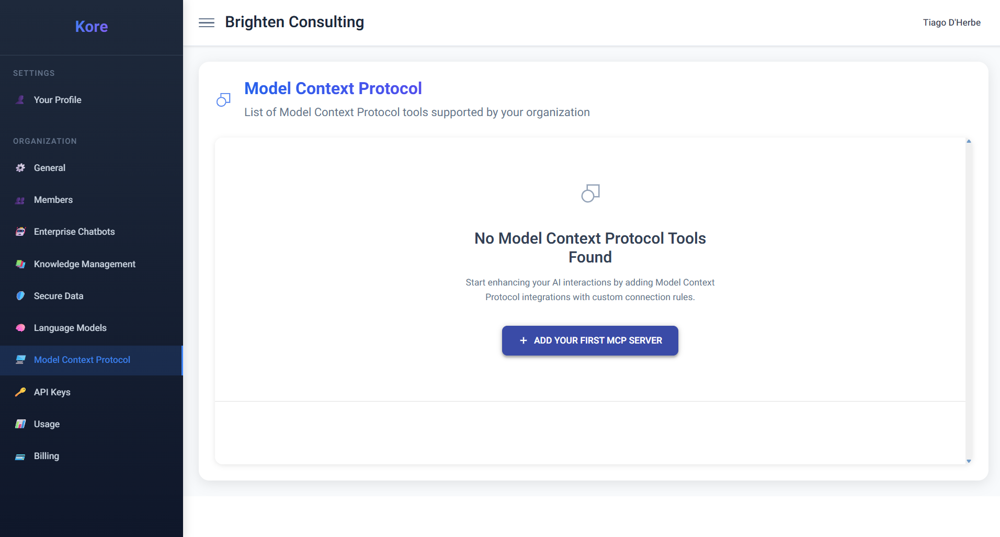
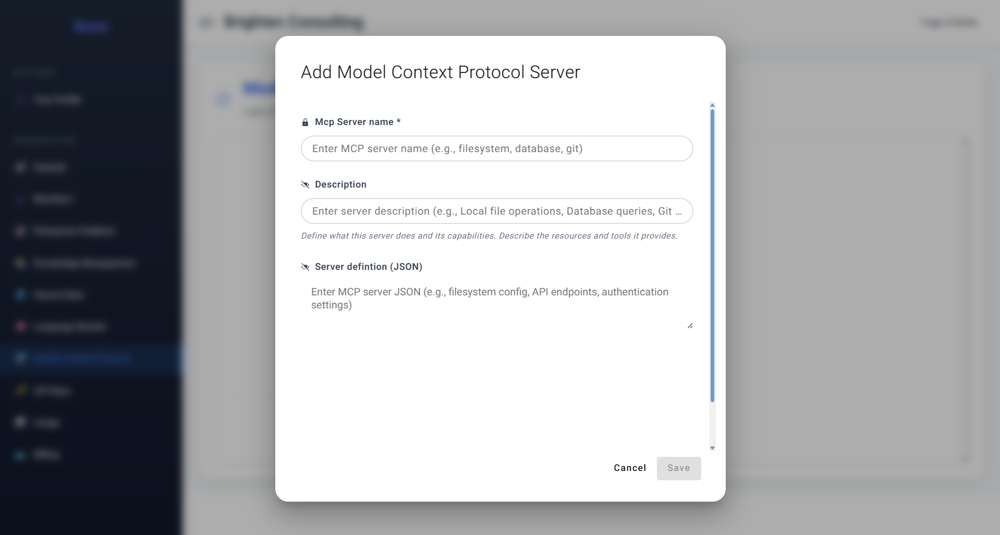

# **Bridging AI with the Enterprise Ecosystem**

In the quest for truly intelligent and actionable AI, the ability for Large Language Models (LLMs) and AI agents to interact with real-world data and external systems is paramount. Compass's **Model Context Protocol (MCP)** implementation represents a groundbreaking leap in this direction. Think of MCP not just as a feature, but as a **universal translator and gateway that empowers AI agents to securely connect with your enterprise's live data sources and tools in real-time.** It liberates AI from the confines of its training data, enabling dynamic, current, and context-aware interactions with your entire digital ecosystem.

At its core, MCP is an **open standard** that defines a unified, standardised way for AI systems to access and interact with external resources. This means instead of being limited to static, potentially outdated information, your AI agents can now seamlessly pull live data from content management systems, interact with development tools, query business applications, and perform actions across various services, all through a singular, robust interface.

*Model Context Protocol, hub for managing AI-external tool integrations.*

## **The Benefits of MCP**

The advantages of this protocol are profound and transformative for both developers and end-users within the enterprise:

  * **For Developers: Eliminating Integration Burden:** MCP dramatically simplifies the development of intelligent AI applications. Developers are freed from the arduous task of building bespoke, separate integrations for every single tool, database, or API their AI needs to access. By implementing MCP once, developers can instantly connect to any MCP-compatible resource. This drastically reduces development time, cuts maintenance overhead, and accelerates the deployment of sophisticated AI solutions.
  * **For End Users: Dynamic, Current, and Capable AI:** For your employees and customers, MCP means AI assistants become exponentially more capable and always current. Instead of providing potentially outdated information, the AI can access live data directly from your actual systems. Imagine an AI checking real-time project status from your development tools, pulling the latest customer information from your CRM, or verifying current inventory levels instantly. This transforms AI from a static knowledge base into a dynamic, interactive intermediary.
  * **Emphasis on Security and User Control:** Security is woven into the fabric of MCP. The protocol inherently emphasises user control, allowing organisations to grant specific, granular permissions for what data the AI can access and what actions it can perform. This ensures sensitive information remains protected while still enabling powerful integrations, maintaining appropriate boundaries and adhering to stringent security protocols.

## **How MCP Works**
### **How the Model Context Protocol Works: A Harmonious Triad**

MCP operates through a synergistic relationship between three main components:

1.  **MCP Hosts:** These are the applications that want AI capabilities and are designed to communicate using the MCP standard. In the context of Compass, your **Enterprise Chatbots** and other AI tools running on the platform act as MCP Hosts.
2.  **MCP Servers:** These are lightweight programs or services designed to connect to specific external data sources or tools. An MCP Server acts as an adapter, translating the MCP standard into the specific language or API of the resource it's connected to. Examples include servers for your file system, various databases (SQL, NoSQL), Git repositories, internal APIs, or third-party business applications.
3.  **The Protocol:** This is the standardised language and communication framework that MCP Hosts and MCP Servers use to interact. It ensures that any MCP-compatible AI can work seamlessly with any MCP-compatible data source without requiring custom programming for each unique combination.

**The Operational Flow:**

When you ask an AI assistant a question or give it a command that requires external data or action, the flow is intuitive:

  * The **MCP Host** (your Compass Enterprise Chatbot, for example) sends a request through the MCP Protocol to the appropriate **MCP Server**.
  * The **MCP Server** then fetches the needed information from its connected data source or performs the requested action (e.g., updating a record, triggering a process).
  * Finally, the server sends the response back through the same standardised MCP Protocol to the **MCP Host**.
  * The AI assistant then incorporates that live, real-time data or confirmation of action into its response, providing you with highly accurate and contextually relevant information.

For example, if you ask an Enterprise Chatbot, "What's the current stock level for product XYZ from our inventory system?", the AI would use MCP to communicate with an inventory management MCP Server. This server would query your live inventory database, retrieve the current stock, and send that information back to the AI, which then incorporates that live data into its comprehensive response.

### **Integrating MCP with Compass: Unlocking Infinite Possibilities**

With Compass, you simply **register an MCP Server** within the platform, making its capabilities instantly available to your AI agents.

*The "Add Model Context Protocol Server" interface for seamless integration.*

  * **MCP Server Name:** A descriptive name to identify the server (e.g., "Filesystem Access," "CRM Database," "Git Operations").
  * **Description:** A clear explanation of what this server does and the specific resources/tools it connects to (e.g., "Local file operations, Database queries, Git repository actions").
  * **Server Definition (JSON):** The crucial JSON configuration that specifies the API endpoints, authentication settings, and other parameters required for Compass to communicate with your MCP Server.

Once registered, a profound transformation occurs: **when your organisation's members are using an Enterprise Chatbot powered by an LLM that supports tool-calling, it will be able to seamlessly tap into this virtually infinite world of handy tools.** This means your AI agents are no longer confined to merely generating text; they can now *perform actions*, *retrieve live data*, and *interact with your entire digital ecosystem*. This powerful conjunction of AI intelligence with real-world tools will undoubtedly bring about the **most outstanding combinations and results**, driving unprecedented levels of automation, accuracy, and enterprise efficiency.

Compass's MCP integration isn't just a technical feature; it's an enablement layer that allows your AI to become a true, active participant in your business operations.
