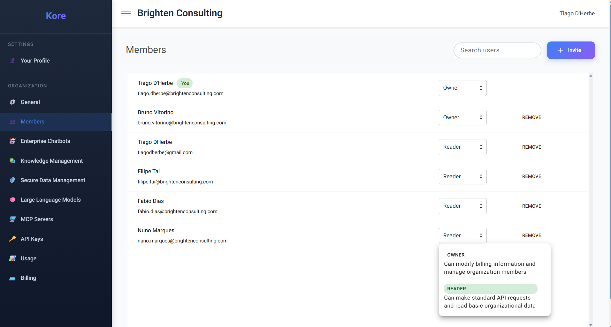

# **Cultivating Your Collaborative AI Ecosystem**

Effective collaboration is the bedrock of enterprise productivity, and Compass's **Members** area is your central hub for building and managing your expert teams within the platform. As shown in the screenshot below, this intuitive interface empowers you to precisely control who participates in your AI initiatives, ensuring secure access and streamlined teamwork across your organisation.

*The Compass Members management interface, illustrating user roles and controls.*

The Members section allows you to seamlessly invite and onboard your organisation's collaborators, fostering a dynamic environment where everyone can contribute to your AI-driven success. Whether you're bringing in new developers to leverage the AI Software Team, content specialists to curate knowledge, or end-users to interact with deployed chatbots, Compass provides the granular control you need.

**Key Capabilities of the Members Area:**

  * **Effortless Invitation & Onboarding:**
    With a simple click of the "Invite" button, you can extend access to new team members. Just enter their email address, and they'll receive an invitation to join your Compass organisation. This streamlined process ensures quick and secure onboarding, getting your colleagues productive without delay.
  * **Flexible Role-Based Access Control (RBAC):**
    Security and functionality go hand-in-hand. As depicted in the screenshot, Compass provides robust Role-Based Access Control to ensure each member has precisely the permissions they need – and no more. Key roles include:
      * **Owner:** This role grants comprehensive control over the organisation's Compass instance. Owners can modify billing information, manage organisation members (inviting, removing, and assigning roles), and oversee all aspects of the platform's configuration and usage. They are the custodians of the Compass environment.
      * **Reader:** Designed for broader access and utilisation, the Reader role allows members to make standard API requests and read basic organisational data. This is ideal for team members who primarily interact with deployed Enterprise Chatbots, access knowledge bases for information discovery, or need to view operational metrics without altering configurations.
      * **Customisable Roles (Future Enhancements):** We are continuously enhancing our RBAC capabilities to provide even more granular control, allowing organisations to define custom roles tailored to specific team functions and security policies.
  * **Empowering Diverse Collaborators:**
    The Members area facilitates various forms of collaboration across your enterprise:
      * **Utilising Enterprise Chatbots:** Simply invite users who need to interact with the AI-powered chatbots you deploy through Compass. They can leverage these intelligent assistants for enhanced customer support, internal queries, or workflow automation.
      * **Managing Knowledge Content:** Empower your knowledge managers, subject matter experts, and content creators to help curate and expand your organisation's knowledge bases. They can upload new documents, connect data sources, and refine information, ensuring your AI agents are always powered by accurate and comprehensive data.
      * **Configuring AI Workflows:** Enable your technical administrators and project leads to manage and refine the configurations of your AI agents, large language models, and secure data management settings, ensuring optimal performance and compliance.
  * **Centralised Member Overview:**
    The clear tabular view in the Members area provides an at-a-glance summary of all your active members, their assigned roles, and quick actions like removing users. This centralised management ensures transparency and control over your collaborative AI ecosystem.

By providing a powerful yet intuitive interface for managing members and their access, Compass ensures that your organisation can efficiently scale its AI initiatives, foster secure collaboration, and maximise the collective intelligence of your human and AI teams.
