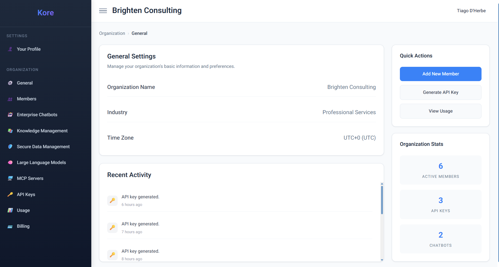

# **Governing AI for Enterprise**

At the heart of every successful digital transformation lies robust governance, security, and the intelligent management of data and AI assets. Compass understands that deploying advanced AI agents and Large Language Models (LLMs) within an enterprise environment demands more than just powerful capabilities; it requires a platform built for control, compliance, and customisation. The **Organization** section of Compass provides a centralised command centre for enterprises to manage their AI ecosystem, ensuring secure, efficient, and strategically aligned operations.

Compass empowers your organisation to harness the full potential of AI while maintaining absolute control over your most critical assets: your data and your intellectual property. As you can see in the **Organization General Settings dashboard below**, Compass offers a clear overview and granular control over your AI initiatives, making it easy to manage your setup, members, and vital statistics at a glance.

*The Compass Organization Settings dashboard, your central command centre.*

## **Secure Enterprise Data**
#### Granular Control & Compliance

In the age of AI, data is paramount, and its security is non-negotiable. Compass is engineered from the ground up with enterprise-grade security features to protect your sensitive information and ensure compliance with stringent regulations.

  * **Secure Data Management, Masking, and PII Compliance:** Compass provides advanced capabilities for comprehensive data protection. This includes **dynamic data masking** and **PII (Personally Identifiable Information) securing compliance** to ensure sensitive data is protected whether at rest or in transit, and when exposed to AI agents. It intelligently obfuscates or anonymises confidential details while maintaining data utility for AI processing, testing, and analytics. This proactive approach is vital for adhering to regulations like GDPR, HIPAA, and CCPA, significantly reducing legal risks and protecting privacy.
  * **Role-Based Access Control (RBAC):** Manage who interacts with AI models and how data is used through precise role-based access controls. This ensures that only authorised personnel and AI agents can access specific data sets, adhering strictly to the principle of least privilege.
  * **Audit Trails & Transparency:** Compass provides comprehensive, immutable audit trails of all data access and AI agent activities. This meticulous logging is crucial for maintaining regulatory compliance and internal governance policies, offering complete transparency and accountability.
  * **Prompt Injection Protection & Content Filters:** Advanced mechanisms are in place to protect against malicious prompt injection attacks and enforce custom content filters, ensuring responsible, safe, and controlled AI interactions.

## **Organisational Brain**
#### Creating Intelligent Silos of Knowledge

Traditional data silos often hinder innovation. Compass transforms this challenge by enabling the creation of *intelligent silos of knowledge* – controlled, secure repositories that fuel your AI agents with relevant, contextualised information. This is where your enterprise's collective wisdom truly becomes actionable.

  * **Isolated Knowledge Bases:** Establish distinct knowledge bases for different departments, projects, or sensitive data sets. This allows AI agents to operate within a defined, secure context, preventing unintended data exposure while ensuring highly accurate responses.
  * **Multi-Format Data Ingestion:** As highlighted in our "Knowledge Discovery & Navigation" use case, Compass can ingest and process data from diverse sources – internal documents (Word, Excel, PowerPoint, PDFs, etc.), connected cloud drives (Microsoft OneDrive, SharePoint), and external web resources (via web scraping). Each piece of data enriches the specific knowledge silos it belongs to.
  * **Contextual RAG (Retrieval-Augmented Generation):** Our advanced RAG capabilities ensure that when an AI agent queries a knowledge silo, it retrieves highly relevant, contextually aware information, leading to more precise and insightful outputs. The ability to identify and store the language of the document (FastRAG) further enhances multilingual knowledge retrieval, ensuring global applicability.

## **Deployment of AI Agents**
### Strategic Deployment of AI Agents with Controlled Knowledge Access

Compass's Organization settings empower you to strategically deploy AI agents, equipping them with precisely the right knowledge while maintaining complete governance and oversight.

  * **Agent-Specific Knowledge Access:** Define precisely which knowledge silos each AI agent or team of agents can access. This ensures that a sales AI agent doesn't access HR data, and a finance agent doesn't touch product development secrets, maintaining strict data segregation and preventing information leakage.
  * **Customisable AI Agent Networks:** Orchestrate complex workflows by creating and configuring teams of AI agents (like our AI Software Team) and assigning them access to relevant knowledge bases. This allows for the development and deployment of sophisticated, multi-step automations grounded in your enterprise's specific, secure data.
  * **Scalable AI Operations:** Deploy and manage AI agents at scale across your organisation, confident that each agent operates within defined boundaries and accesses only authorised information, ensuring compliant and efficient AI adoption.
  * **Centralised Management:** The Organization dashboard, as depicted in the screenshot, provides a unified view of your active members, API keys, and deployed chatbots, giving you a comprehensive overview of your AI footprint, resource utilisation, and activity history.

By providing robust security, flexible knowledge management, and granular control over AI agent deployment, Compass transcends being just a development platform. It becomes the foundational AI layer that ensures your enterprise can innovate rapidly, manage sensitive data securely, and derive maximum value from its AI investments, all from a trusted platform.