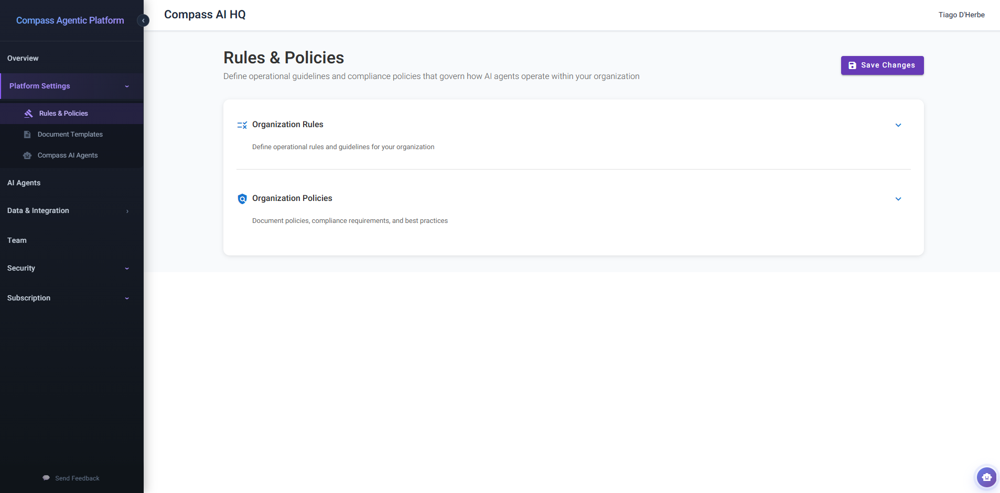

# **Rules & Policies: Embedding Governance into AI Intelligence**

> ### Quick Start: Defining Your Organization's AI Governance
>
> 1.  **Login to Compass:** Access your Compass account with admin privileges.
> 2.  **Navigate to Organization > Rules & Policies:** In the left-hand navigation, select "Organization" then "Rules & Policies."
> 3.  **Upload or Define Rules:** Upload existing documents or manually define rules using the markdown editor.
> 4.  **Set Policies:** Upload policy documents or manually define compliance requirements.
> 5.  **Save Changes:** Activate your governance framework across all Compass AI agents.

In the era of enterprise AI adoption, the most significant challenge organisations face isn't the capability of artificial intelligence—it's ensuring that AI operates within the boundaries of organisational governance, regulatory compliance, and established best practices. Compass's **Rules & Policies** section transforms this challenge into a strategic advantage, enabling your organisation to seamlessly embed your existing governance frameworks directly into the intelligence of every AI agent that operates on your behalf.

*Rules & Policies management dashboard with intelligent document parsing.*

Think of Compass's Rules & Policies as the constitutional framework for your AI ecosystem. Just as human employees must understand and comply with organisational policies, your AI agents require the same foundational knowledge to operate responsibly and effectively. The difference? With Compass, this governance isn't enforced through periodic training sessions or policy manuals that gather dust—it's woven directly into the cognitive fabric of your AI agents, influencing every task they perform and every output they generate.

## **The Intelligent Document Transformation Engine**

### From Static Documents to Active AI Governance

What sets Compass's Rules & Policies apart is the sophisticated **intelligent parsing and transformation engine** that works behind the scenes. When you upload your existing governance documents—whether they're comprehensive ISO standards, internal coding guidelines, brand style guides, or regulatory compliance frameworks—Compass doesn't simply store them. Instead, it intelligently transforms them for AI consumption:

**Intelligent Content Extraction**

Compass employs advanced document parsing algorithms that understand the structure and semantics of your policy documents, regardless of format:

  * **Multi-Format Support:** Seamlessly process documents in PDF (.pdf), Microsoft Word (.doc, .docx), Excel spreadsheets (.xls, .xlsx), and PowerPoint presentations (.ppt, .pptx). Whether your policies exist as formatted reports, tabular data, or presentation slides, Compass extracts the meaningful content.

  * **Structural Understanding:** The system recognises document hierarchies, section headings, bullet points, numbered lists, tables, and formatting cues that indicate importance or relationships between concepts.

  * **Contextual Preservation:** Unlike basic text extraction that loses formatting context, Compass preserves the semantic meaning of your documents. A section titled "Prohibited Actions" is understood as constraints, while "Best Practices" sections are recognised as guidance.

**Content Cleaning and Optimisation**

Raw document content often contains elements that are meaningful for human readers but noise for AI systems. Compass's cleaning engine specifically optimises content for AI agent consumption:

  * **Removal of Visual Artifacts:** Headers, footers, page numbers, watermarks, and formatting elements are intelligently stripped away, leaving only substantive policy content.

  * **Table Transformation:** Complex tables are converted into structured data formats that AI agents can query and reference, transforming spreadsheet-based compliance matrices into actionable rules.

  * **Language Normalisation:** Legalese, corporate jargon, and ambiguous phrasing are identified and can be flagged, ensuring that guidance provided to AI agents is clear, unambiguous, and actionable.

  * **Duplicate Elimination:** When multiple documents contain overlapping policies, Compass identifies and consolidates redundant content, creating a coherent, non-contradictory governance framework.

**AI-Optimised Knowledge Representation**

The final transformation converts your cleaned policy content into a format specifically designed for AI agent reasoning:

  * **Semantic Chunking:** Policies are broken into logical, contextual chunks that align with how AI agents process information, ensuring relevant guidance is retrieved precisely when needed.

  * **Relationship Mapping:** Connections between related policies are established—for instance, linking "Code Review Standards" with "Security Requirements" policies, enabling AI agents to apply holistic, interconnected thinking.

  * **Priority Weighting:** Critical compliance requirements can be distinguished from general guidance, ensuring AI agents prioritise adherence to regulatory mandates over stylistic preferences.

  * **Query Optimisation:** Content is indexed and structured to enable rapid retrieval during AI agent task execution, ensuring policy consultation doesn't slow down agent performance.

## **Dual Framework: Rules vs. Policies**

### Understanding the Distinction for Strategic Governance

Compass recognises that organisational governance operates on multiple levels, which is why the system provides two distinct yet complementary sections:

### **Organization Rules: Operational Guidelines and Best Practices**

The **Organization Rules** section is designed for defining day-to-day operational guidelines, best practices, and methodological standards that guide how work is performed within your organisation:

**Ideal Content for Organization Rules:**

  * **Coding Standards:** Language-specific conventions (naming conventions, indentation styles, comment requirements), architectural patterns (microservices guidelines, API design principles), framework-specific best practices (React component structure, Angular module organisation).

  * **Development Workflows:** Git branching strategies, code review requirements, testing coverage expectations, documentation standards, deployment procedures, release management protocols.

  * **Communication Protocols:** Email formatting standards, meeting documentation requirements, stakeholder reporting templates, escalation procedures, internal terminology conventions.

  * **Quality Standards:** Definition of "done" criteria, acceptance testing requirements, performance benchmarks, user experience guidelines, accessibility standards.

  * **Operational Procedures:** Incident response workflows, change management processes, vendor engagement protocols, project initiation requirements, resource allocation guidelines.

**Strategic Value:**

By defining these operational rules, you ensure that every AI agent performing work on behalf of your organisation operates with the same methodological rigour as your most experienced team members. A code generation agent will automatically apply your organisation's specific architectural patterns. A documentation assistant will format reports according to your established templates. A research agent will cite sources using your preferred citation style.

### **Organization Policies: Compliance Requirements and Mandatory Standards**

The **Organization Policies** section is reserved for higher-order governance: regulatory compliance requirements, legal constraints, ethical guidelines, and non-negotiable organisational mandates:

**Ideal Content for Organization Policies:**

  * **Regulatory Compliance:** GDPR data protection requirements, HIPAA healthcare information handling, SOX financial controls, PCI-DSS payment card standards, industry-specific regulations (FDA for pharmaceuticals, FCA for financial services).

  * **Security Policies:** Data classification standards, access control requirements, encryption mandates, vulnerability disclosure protocols, incident reporting obligations, acceptable use policies.

  * **Ethical Guidelines:** AI ethics principles, bias prevention requirements, transparency mandates, explainability standards, human oversight requirements, algorithmic accountability frameworks.

  * **Legal Constraints:** Intellectual property protection requirements, licensing compliance, contractual obligations, non-disclosure requirements, export control restrictions.

  * **Corporate Governance:** Financial approval thresholds, procurement policies, conflict of interest declarations, risk management frameworks, audit requirements, board-level mandates.

  * **Human Resources Policies:** Equal opportunity requirements, harassment prevention, workplace safety, confidentiality obligations, professional conduct standards.

**Strategic Value:**

These policies represent the non-negotiable boundaries within which your AI agents must operate. When an AI agent is asked to generate code that might introduce a security vulnerability, your security policies are immediately consulted, and the agent refuses or modifies the approach. When handling sensitive data, GDPR compliance policies are automatically applied. When drafting external communications, legal review requirements are factored into the agent's workflow recommendations.

### **The Symbiotic Relationship**

While distinct, Rules and Policies work together to create a comprehensive governance framework:

  * **Hierarchical Compliance:** Policies override rules in cases of conflict. If a coding standard suggests an approach that violates a security policy, the policy takes precedence.

  * **Contextual Application:** AI agents understand when to primarily consult rules (during routine development tasks) versus when to heavily reference policies (when handling sensitive data or operating in regulated domains).

  * **Holistic Reasoning:** Sophisticated AI agents can reason across both dimensions—for instance, suggesting a technical implementation that adheres to coding standards (rules) while ensuring the implementation includes necessary audit logging (policy requirement).

## **How AI Agents Leverage Rules & Policies**

### From Static Documents to Active Intelligence

The true power of Compass's Rules & Policies becomes apparent when you understand how AI agents actively consult and apply this governance framework during task execution:

**Pre-Task Consultation**

Before beginning any significant task, Compass AI agents perform a governance review:

  * **Task Classification:** The agent determines the nature of the task (code generation, data analysis, document creation, research, etc.) and identifies which rules and policies are most relevant.

  * **Constraint Identification:** Policies that impose hard constraints (e.g., "All database queries must use parameterised statements to prevent SQL injection") are flagged as non-negotiable requirements.

  * **Guidance Retrieval:** Rules that provide best practice guidance (e.g., "React components should follow the function component pattern with hooks") are loaded as preferences to guide decision-making.

**During-Task Compliance Verification**

As the AI agent works, continuous compliance checking occurs:

  * **Real-Time Policy Validation:** When an agent is about to generate code, create a document, or propose a solution, it performs a rapid compliance check against loaded policies. If the proposed action would violate a policy, the agent either modifies its approach or surfaces a warning.

  * **Best Practice Application:** Rules are applied as heuristics to guide the agent's choices. When multiple valid approaches exist, the agent selects the one most aligned with your documented best practices.

  * **Contextual Reasoning:** Agents don't apply rules and policies blindly. They understand context—for instance, recognising that a "no hardcoded credentials" policy applies to production code but may be relaxed in a local development example, with appropriate warnings.

**Post-Task Compliance Reporting**

After completing a task, agents can provide governance transparency:

  * **Compliance Confirmation:** The agent can report which key policies were consulted and how the output complies with them, providing audit trail evidence.

  * **Deviation Explanations:** If circumstances required deviation from a standard best practice, the agent can explain the reasoning and flag the deviation for human review.

  * **Policy Gap Identification:** Advanced agents can identify situations where no clear policy guidance existed, suggesting areas where your governance framework might benefit from expansion.

### **Real-World Examples**

**Scenario 1: Code Generation with Security Policies**

A software development team uses a Compass chatbot to generate a user authentication module. The organization has uploaded security policies requiring multi-factor authentication, encrypted credential storage, session timeouts, and comprehensive logging.

Without Rules & Policies, the AI agent might generate a basic username/password authentication system. **With Rules & Policies integrated**, the agent automatically includes MFA implementation, uses industry-standard encryption libraries, implements the required session timeout, adds comprehensive logging, and provides code comments referencing the specific security policies being satisfied.

The developer receives code that's not just functional, but **compliant by design**.

**Scenario 2: Document Creation with Brand Guidelines**

A marketing team uses a Compass chatbot to draft a customer-facing product announcement. The organization has uploaded brand guidelines specifying tone of voice, terminology standards, mandatory legal disclaimers, and accessibility requirements.

The AI agent drafts the announcement, automatically adjusting the tone to match brand voice, correctly capitalising all product names, including the mandatory legal disclaimer, rewriting technical jargon into accessible language, and providing a note about which brand guideline sections were followed.

The marketing professional receives a draft that's already **90% compliant**, requiring only minor tweaks rather than extensive rewrites.

**Scenario 3: Data Analysis with GDPR Compliance**

A data analyst uses a Compass chatbot to analyse customer behaviour patterns. The organization has uploaded GDPR policies requiring anonymisation, data minimisation, purpose limitation, and consent verification.

The AI agent, before beginning analysis, checks that appropriate consent exists, automatically anonymises customer identifiers, limits data columns processed to only those necessary, flags potential privacy concerns for human review, and documents the legal basis for processing in the analysis report.

The analyst can proceed with confidence, knowing that the analysis is **privacy-compliant from the start**.

## **Enterprise Benefits: Governance at Scale**

### Transforming AI from Risk to Strategic Asset

By embedding your Rules & Policies directly into AI agent intelligence, Compass delivers transformative enterprise benefits:

**Risk Mitigation and Compliance Assurance**

  * **Proactive Compliance:** Rather than relying on post-hoc reviews to catch compliance violations, compliance is built into every AI-generated output from the start, dramatically reducing risk exposure.

  * **Audit Trail Creation:** Every AI agent interaction that references policies creates an auditable record, demonstrating due diligence to regulators and internal audit teams.

  * **Consistent Application:** Human employees may forget policies, misinterpret guidelines, or apply them inconsistently. AI agents consult policies with perfect consistency, ensuring uniform governance across all activities.

  * **Regulatory Agility:** When regulations change, update your policies once in Compass, and all AI agents immediately operate under the new framework—no re-training required.

**Quality and Consistency Elevation**

  * **Eliminating Variability:** Every AI agent, regardless of which team member is using it, applies the same standards, eliminating quality variability that plagues organisations relying on individual interpretation of guidelines.

  * **Institutionalising Best Practices:** Your organisation's hard-won best practices—learned through years of experience—are instantly accessible to every AI agent, ensuring institutional knowledge isn't lost and is consistently applied.

  * **Reducing Rework:** When AI-generated outputs comply with standards from the start, you eliminate costly rework cycles that occur when non-compliant work must be revised.

**Operational Efficiency**

  * **Accelerated Onboarding:** New team members using Compass AI agents inherit the organisation's entire governance framework immediately, dramatically shortening the learning curve for institutional standards.

  * **Reduced Review Burden:** When AI agents automatically apply governance standards, human reviewers can focus on higher-order considerations rather than checking basic compliance with known rules.

  * **Self-Service Compliance:** Teams can confidently use AI agents for sensitive tasks without requiring constant oversight from compliance specialists, freeing experts to focus on strategic governance questions.

**Strategic Governance Evolution**

  * **Data-Driven Policy Development:** By observing which policies most influence AI agent behaviour and which gaps emerge, governance teams can make evidence-based decisions about policy priorities.

  * **Cross-Functional Alignment:** The Rules & Policies framework becomes a single source of truth, aligning technical teams, compliance officers, legal counsel, and business units around common standards.

  * **Continuous Improvement Culture:** The ease of updating policies in Compass encourages organisations to treat governance as an iterative process rather than a static burden, fostering a culture of continuous improvement.

## **Best Practices for Rules & Policies Management**

### Maximising the Value of Your Governance Framework

To extract maximum value from Compass's Rules & Policies capabilities, consider these strategic best practices:

**Start with Clarity and Specificity**

  * **Actionable Language:** Frame policies as clear, actionable directives rather than vague aspirations. "All user passwords must be hashed using bcrypt with a work factor of 12" is far more useful to an AI agent than "Passwords should be secured."

  * **Explicit Examples:** Include concrete examples of compliant and non-compliant approaches. AI agents learn exceptionally well from examples, using them to generalise to novel situations.

  * **Prioritisation Indicators:** Use language that conveys priority—"must," "required," "mandatory" for non-negotiable policies; "should," "recommended," "preferred" for best practices where flexibility exists.

**Organise for Discoverability**

  * **Logical Sections:** Structure your policies with clear headings and hierarchies. An AI agent searching for database security guidance should easily navigate to a "Data Security" section within your policies.

  * **Consistent Terminology:** Use consistent terms throughout your policies. If you refer to "personally identifiable information" in one section, don't switch to "PII" or "personal data" in another without explicitly noting the equivalence.

  * **Cross-References:** When policies relate to each other, include explicit cross-references, helping AI agents understand the connections between different governance requirements.

**Balance Comprehensiveness with Maintainability**

  * **Focus on High-Impact Areas:** Begin with policies that govern the most frequent AI agent tasks or the highest-risk activities, rather than attempting to document every conceivable scenario upfront.

  * **Avoid Redundancy:** Don't replicate content across Rules and Policies sections. If a requirement appears in Policies (as a mandatory compliance item), don't repeat it in Rules—AI agents will consult both.

  * **Regular Review Cycles:** Establish a quarterly or semi-annual review process to retire outdated policies, update changed requirements, and add new guidance based on organisational learning.

**Test with Real Tasks**

  * **Validation Through Use:** After uploading new policies, test how AI agents interpret them by assigning representative tasks and reviewing the outputs for compliance and quality.

  * **Iterate Based on Results:** If agents misinterpret a policy, misapply a rule, or identify gaps, immediately refine the governance content to address the issue.

  * **User Feedback Loops:** Encourage teams using Compass to report instances where AI agents either over-applied or under-applied policies, using this feedback to calibrate your governance framework.

**Integrate with Broader Governance Processes**

  * **Alignment with Change Management:** When your organisation updates a policy or standard outside of Compass, ensure those changes are promptly reflected in the Compass Rules & Policies framework.

  * **Stakeholder Collaboration:** Involve relevant stakeholders (legal counsel, compliance officers, security teams, technical leads) in defining and reviewing the policies that govern AI agents in their domains.

  * **Documentation of Rationale:** When uploading policies, consider adding brief context about why specific requirements exist, helping future administrators understand the reasoning and make informed decisions about potential changes.

## **Building a Living Governance Framework**

Your Rules & Policies framework isn't a one-time setup—it's a **living governance system** that evolves with your organisation:

**Incremental Enhancement**

Start with your most critical policies and gradually expand through phased implementation: Begin with core compliance requirements and critical security policies, then add operational rules and coding standards, expand to domain-specific guidance for different teams, and finally establish continuous refinement as your organisation learns from AI agent outputs.

**Multi-Source Integration**

Your governance framework can synthesise from diverse sources: external standards (ISO, NIST, OWASP, W3C), industry regulations (HIPAA, SOX, GDPR, CCPA), internal documentation (coding standards, architectural principles, methodologies), and vendor requirements (contractual obligations, partner integration standards, audit requirements).

**Feedback-Driven Improvement**

Use real-world AI agent performance to refine your governance by monitoring how agents interpret and apply policies, integrating user feedback when corrections or modifications are requested, and tracking policy effectiveness to prioritise maintenance efforts.

## **Getting Started: Your Governance Journey**

Ready to establish your AI governance framework in Compass? Follow this practical roadmap:

**Week 1: Audit and Prioritise**

  * Inventory your existing governance documentation—where do policies currently live?
  * Identify the highest-priority policies: regulatory requirements, critical security standards, and non-negotiable operational rules
  * Determine which teams will be early adopters of Compass AI agents, focusing on governance relevant to their work

**Week 2: Initial Upload and Configuration**

  * Upload your priority policy documents to the Organization Policies section, focusing on compliance-critical content
  * Upload key operational standards to the Organization Rules section, emphasising guidelines for the most common AI agent tasks
  * Test with a small set of representative tasks to validate that AI agents correctly interpret the uploaded governance

**Week 3: Refinement and Expansion**

  * Based on testing feedback, refine ambiguous policies, clarify vague rules, and add examples where needed
  * Expand coverage to additional domains based on learnings from the initial deployment
  * Develop a communication plan to inform teams about the governance framework and how it enhances AI agent reliability

**Month 2 and Beyond: Continuous Improvement**

  * Establish a regular review cycle (monthly or quarterly) to update policies based on regulatory changes, lessons learned, and user feedback
  * Track metrics on AI agent compliance, quality, and user satisfaction to measure the impact of your governance framework
  * Iterate on policy content, organisation, and specificity based on real-world performance data

## **Conclusion: AI Agents You Can Trust**

In an enterprise environment, trust isn't optional—it's fundamental. Teams must trust that AI-generated code won't introduce security vulnerabilities. Compliance officers must trust that AI-drafted documents adhere to regulatory requirements. Executives must trust that AI-enabled productivity gains won't create legal or reputational risks.

Compass's **Rules & Policies** framework is how you establish that trust. By intelligently parsing your existing governance documents and embedding them directly into AI agent intelligence, Compass ensures that every task performed, every output generated, and every decision made aligns with your organisation's standards, values, and obligations.

This isn't just about compliance—it's about **unlocking the full potential of AI** within your enterprise. When teams trust AI agents to operate within appropriate boundaries, adoption accelerates. When compliance officers see that governance is built-in, resistance dissolves. When executives witness both productivity gains and risk mitigation, strategic AI investment becomes inevitable.

Your organisation's rules, policies, standards, and expertise represent decades of accumulated wisdom. Compass ensures that wisdom doesn't just inform human decision-making—it guides every AI agent, making your entire AI ecosystem more intelligent, more compliant, and more aligned with your strategic objectives.

---

*Transform your static governance documents into active AI intelligence. Define your Rules & Policies in Compass today and experience AI agents that don't just assist—they comply, align, and elevate your organisation's standards with every interaction.*
