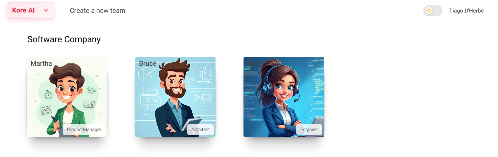
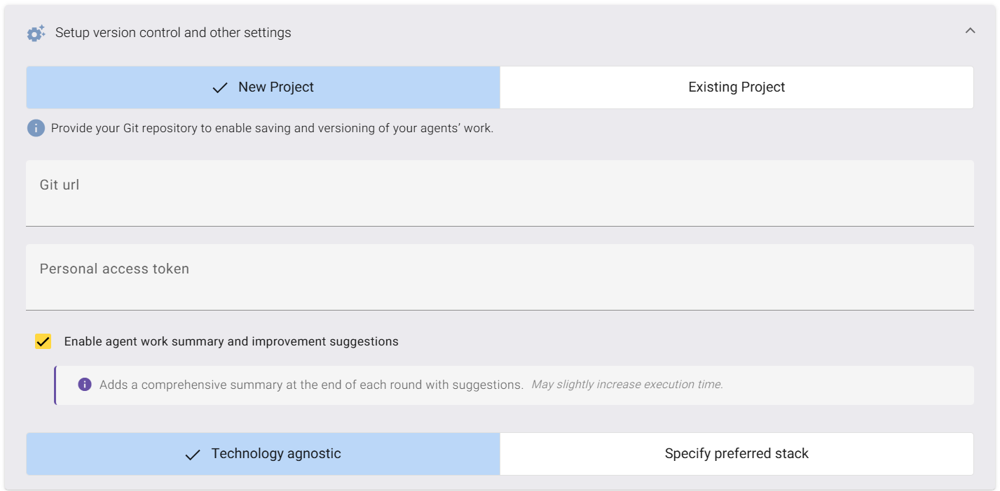
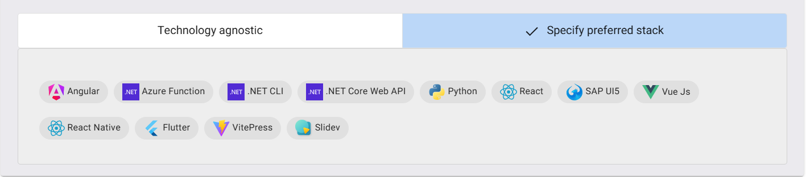
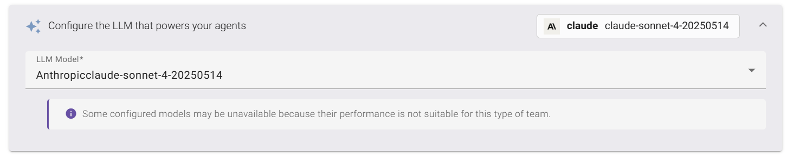

# Creating Your First AI Software Team 🚀

Welcome! This guide will walk you through creating a new AI-powered software team to build your project from the ground up. We'll cover selecting your AI agents, configuring version control with Git, and choosing the right Large Language Model (LLM) to power your team.

## Step 1: Assemble Your AI Team

First, let's assemble your specialized AI team. For a typical software project, you'll have a core group of agents designed to emulate a real-world software company.

The available roles are:

  * **Product Manager:** To define features and manage the project scope.
  * **Architect:** To design the system's structure and technical strategy.
  * **Engineer:** To write, test, and implement the code.

## Step 2: Configure Project Settings & Version Control

With your team assembled, it's time to set up the foundation for your project. This section ensures that all the work done by your AI agents is properly versioned and saved.

### New Project vs. Existing Project

Kore AI gives you two options to start:

  * **New Project:** Choose this if you're starting from scratch. Kore AI will expect a new, empty Git repository to save and version your agents' work.
  * **Existing Project:** Choose this if you already have a codebase in a Git repository that you want your new AI team to analyze and work on.

For this tutorial, we will focus on creating a **New Project**.

### Connecting to Git

To enable version control, you need to provide credentials for your Git repository.

  * **Git url:** This is the URL to your remote Git repository (e.g., on GitHub, GitLab, or Bitbucket). For a new project, this should point to an empty repository.
  * **Personal access token (PAT):** This is a secure token that grants Kore AI permission to push code to your repository on your behalf.

:::warning SECURITY NOTICE
Your **Personal Access Token** is a sensitive credential. Treat it like a password. Ensure it has the minimum required permissions (e.g., `repo` scope for GitHub) and set an expiration date.
:::

### Optional Enhancements

You can further refine how your team operates with these settings:

  * ✅ **Enable agent work summary and improvement suggestions:** Ticking this box provides a comprehensive summary after each work cycle. It's great for tracking progress and getting insights, though it may slightly increase execution time.

### Defining the Technology Stack

You can either let the AI decide the best technologies or guide its choices.

  * **Technology agnostic:** This is the default option. Your AI team will analyze the project requirements and choose the most suitable technology stack.
  * **Specify preferred stack:** This allows you to guide the AI team by pre-selecting the technologies you want them to use. This is perfect for when you need to adhere to specific technical standards.

## Step 3: Configure the LLM That Powers Your Agents 🧠

The final step is to choose the Large Language Model (LLM) that will act as the "brain" for your agents. The performance and quality of your AI team's work can vary significantly depending on the model you choose.

Click on the **Configure the LLM** bar to expand the options. You can select your preferred model from a dropdown list from providers like OpenAI and Anthropic.

:::info Model Suitability
Please note the informational message: "Some configured models may be unavailable because their performance is not suitable for this type of team." Kore AI ensures that you only use models that are optimized for the complex tasks of software development.
:::

## Step 4: Launch Your Team!

Once you've reviewed all your settings, simply click the **Create team** button.

Congratulations! You've successfully configured and launched your first AI software team. Kore AI will now begin working on your project based on your specifications, pushing all progress directly to your Git repository. Happy building!
